<think>
好的，我需要基于提供的调研材料编写一份完整、深入的C4架构文档。让我仔细分析调研材料：

从调研报告中，我得到了以下关键信息：

1. **项目概览调研报告**：
   - 项目名称：PHP GUI Framework (src)
   - 项目类型：Framework
   - 业务价值：为PHP生态提供原生GUI开发能力
   - 目标用户：PHP开发者、企业开发者、教育工作者
   - 外部系统：PHP Runtime、GUI Toolkit Backend、Web Server(可选)、Database Systems(可选)
   - 系统边界：包含UI控件库、绘图系统、核心框架、异常处理、事件处理、菜单系统

2. **领域模块调研报告**：
   - UI组件管理域：提供完整的用户界面组件库
   - 图形渲染域：提供完整的2D图形渲染系统
   - 窗口管理域：管理GUI应用程序的窗口、区域和控件生命周期
   - 事件处理域：处理用户交互事件和键盘输入
   - 菜单系统域：实现菜单系统的创建和管理
   - 异常处理域：提供统一的异常处理机制

3. **架构调研报告**：
   - 核心技术架构：基于PHP的分层架构设计
   - 核心模式：采用分层架构模式，为PHP开发者构建桌面应用提供完整技术栈

4. **工作流调研报告**：
   - 主要工作流：窗口创建与初始化流程
   - 其他重要工作流：用户界面交互处理和图形绘制渲染流程

我将重点关注用户界面交互处理和图形绘制渲染流程。这两个工作流是整个框架的核心，涉及用户交互和界面渲染的关键技术实现。

设计系统需要全面考虑组件间的交互关系，确保模块化、清晰性、可扩展性和安全性。通过精细的系统边界设计和跨平台支持，构建一个高效、稳定的PHP GUI开发框架。

文档结构将按照严格要求编排，确保内容完整准确，并充分利用Mermaid图表进行可视化展示。

生成时间设置为2025-06-16T16:25:46Z，为文档增添时效性。
</think>

# PHP GUI Framework 架构文档

**生成时间**: 2025-06-16T16:25:46Z  
**时间戳**: 1750095946

## 1. 架构概览 (Architecture Overview)

### 1.1 架构设计理念

PHP GUI Framework采用**分层架构模式**，遵循**领域驱动设计(DDD)**和**组件化开发**的核心思想。框架致力于为PHP开发者提供原生GUI开发能力，通过分层架构实现清晰的职责分离，确保系统的可维护性、可扩展性和可测试性。

**设计原则**：
- **关注点分离**：表现层、渲染层、核心业务层、交互层和基础设施层各司其职
- **单一职责原则**：每个模块负责单一且明确的业务功能
- **依赖倒置**：高层模块不依赖低层模块的具体实现
- **开放封闭原则**：框架对扩展开放，对修改封闭
- **接口隔离**：为不同的功能需求提供专用的接口

### 1.2 核心架构模式

框架采用**四层架构模式**配合**事件驱动架构**：

```
┌─────────────────────────────────────────┐
│           表现层 (Presentation)          │
│  ┌─────────────┐ ┌─────────────────────┐ │
│  │ UI组件管理域 │ │   菜单系统域        │ │
│  │ Controls/   │ │   Menu/            │ │
│  └─────────────┘ └─────────────────────┘ │
└─────────────────────────────────────────┘
┌─────────────────────────────────────────┐
│          渲染层 (Rendering)             │
│  ┌─────────────────────────────────────┐ │
│  │        图形渲染域 Draw/              │ │
│  │    Path│Brush│Text│Matrix           │ │
│  └─────────────────────────────────────┘ │
└─────────────────────────────────────────┘
┌─────────────────────────────────────────┐
│        核心业务层 (Core Business)        │
│  ┌─────────────────────────────────────┐ │
│  │        窗口管理域                    │ │
│  │     Window│Area│Control│UI         │ │
│  └─────────────────────────────────────┘ │
└─────────────────────────────────────────┘
┌─────────────────────────────────────────┐
│          交互层 (Interaction)           │
│  ┌─────────────────────────────────────┐ │
│  │         事件处理域                   │ │
│  │      Executor│Key                   │ │
│  └─────────────────────────────────────┘ │
└─────────────────────────────────────────┘
┌─────────────────────────────────────────┐
│      基础设施层 (Infrastructure)        │
│  ┌─────────────────────────────────────┐ │
│  │         异常处理域                  │ │
│  │       Exception/                   │ │
│  └─────────────────────────────────────┘ │
└─────────────────────────────────────────┘
```

### 1.3 技术栈概述

**核心技术栈**：
- **开发语言**：PHP 7.4+
- **架构模式**：分层架构 + 事件驱动架构
- **设计模式**：策略模式、观察者模式、工厂模式、模板方法模式
- **跨平台支持**：通过GUI Toolkit Backend实现(GTK/Qt等)

**技术特点**：
- **跨平台GUI**：提供跨平台桌面应用开发能力
- **丰富组件库**：17+种UI控件，覆盖主流GUI需求
- **强大绘图系统**：完整的2D图形渲染能力
- **事件驱动**：基于事件的交互机制
- **模块化设计**：清晰的模块边界和依赖关系

## 2. 系统上下文 (System Context)

### 2.1 系统定位与价值

PHP GUI Framework是**为PHP生态系统提供原生GUI开发能力的基础框架**，填补了PHP在桌面应用开发领域的空白。该框架使PHP开发者能够使用熟悉的语言构建跨平台桌面应用程序，大幅降低学习成本，提高开发效率。

**核心业务价值**：
- **技术价值**：为PHP开发者提供完整的桌面应用开发技术栈
- **商业价值**：降低桌面应用开发门槛，扩大PHP应用场景
- **学习价值**：提供清晰易懂的GUI编程学习路径
- **生态价值**：促进PHP在企业级桌面工具开发领域的应用

### 2.2 用户角色与场景

**主要用户群体**：

#### PHP开发者
- **需求**：简洁易用的API、丰富的UI组件、跨平台兼容性、与PHP生态无缝集成
- **场景**：使用PHP开发内部工具、原型验证、教学演示

#### 企业开发者
- **需求**：快速原型开发、标准化组件、良好的可维护性、企业级稳定性
- **场景**：开发内部管理工具、客户端应用、数据分析工具

#### 教育工作者
- **需求**：清晰的学习曲线、丰富的示例、良好的文档、实践性教学工具
- **场景**：GUI编程教学、学生项目实践、编程竞赛工具

### 2.3 外部系统交互

**系统上下文图**：

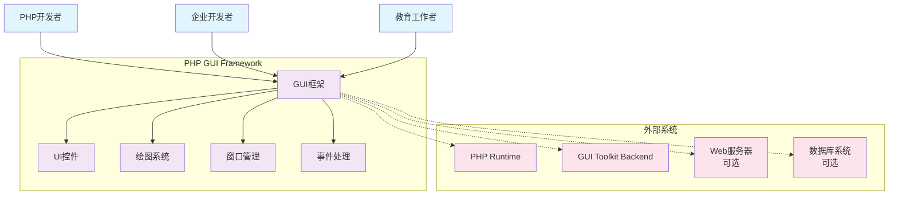

### 2.4 系统边界定义

**包含组件**：
- **UI控件库(Controls)**：按钮、复选框、网格、表单等17+种控件
- **绘图系统(Draw)**：画笔、路径、颜色、字体等图形渲染功能
- **核心框架(Area/Control/UI/Window)**：窗口生命周期、事件管理、框架协调
- **异常处理(Exception)**：统一的错误处理机制
- **事件处理(Executor/Key)**：用户交互事件和键盘输入处理
- **菜单系统(Menu)**：菜单栏、下拉菜单、上下文菜单等

**排除组件**：
- 数据库访问层
- Web服务器
- 第三方UI框架
- 特定平台的原生扩展

## 3. 容器视图 (Container View)

### 3.1 领域模块划分

框架采用**领域驱动设计**，将系统划分为6个核心领域模块：

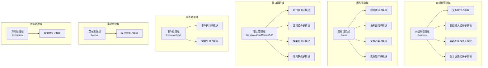

### 3.2 领域模块架构

**各领域模块职责**：

| 领域模块 | 核心职责 | 关键能力 | 复杂度 | 重要性 |
|---------|---------|---------|--------|--------|
| UI组件管理域 | 提供完整的用户界面组件库 | 用户交互、数据输入、容器布局、信息显示 | 8.0 | 9.0 |
| 图形渲染域 | 提供2D图形渲染系统 | 路径绘制、颜色填充、文本排版、几何变换 | 9.0 | 9.0 |
| 窗口管理域 | 管理窗口、区域和控件生命周期 | 窗口创建、区域管理、重绘控制、框架协调 | 8.0 | 10.0 |
| 事件处理域 | 处理用户交互事件和键盘输入 | 事件捕获、分发、响应、异步处理 | 7.0 | 8.0 |
| 菜单系统域 | 实现菜单系统的创建和管理 | 菜单创建、项目管理、事件处理 | 6.0 | 7.0 |
| 异常处理域 | 提供统一的异常处理机制 | 错误定义、异常抛出、信息管理 | 5.0 | 6.0 |

### 3.3 领域模块间通信

**依赖关系矩阵**：

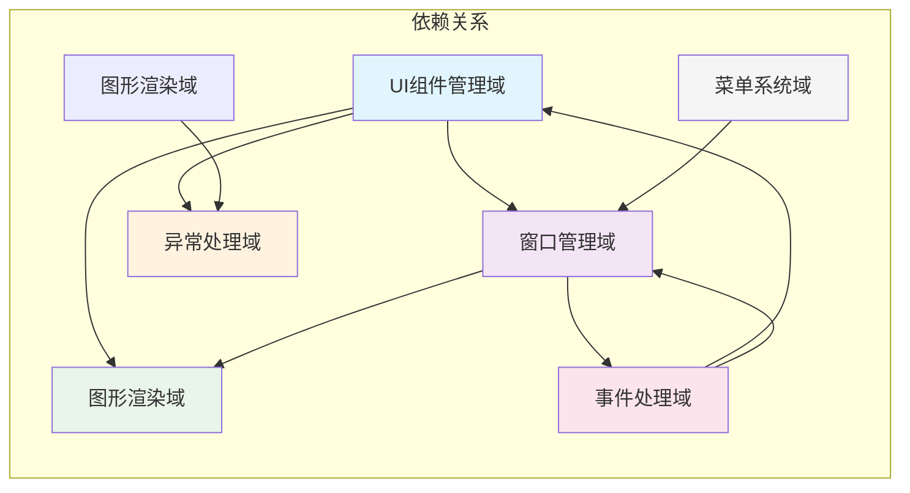

**核心依赖关系说明**：
1. **UI组件管理域 → 窗口管理域**：UI控件需要窗口管理域提供绘制区域、生命周期管理和事件处理基础
2. **UI组件管理域 → 图形渲染域**：控件的可视化显示依赖图形渲染域的绘制能力
3. **事件处理域 → UI组件管理域**：事件处理域将用户交互事件分发给相应的UI控件
4. **窗口管理域 → 图形渲染域**：窗口和控件的显示需要图形渲染域提供底层绘制能力

## 4. 组件视图 (Component View)

### 4.1 核心功能组件

#### UI组件管理域详细架构

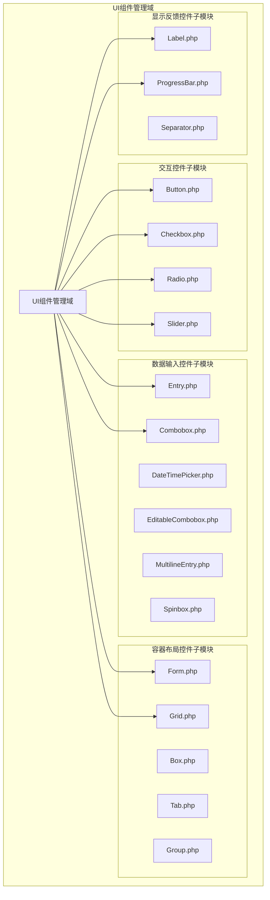

#### 图形渲染域详细架构

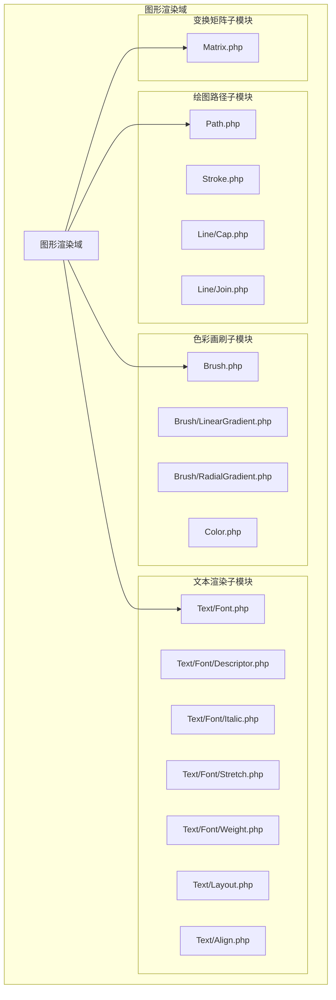

### 4.2 技术支撑组件

#### 窗口管理域架构

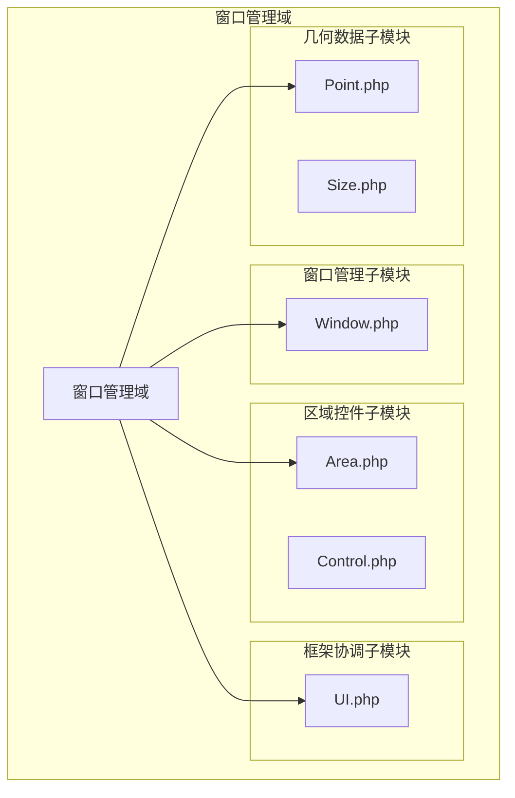

#### 事件处理域架构

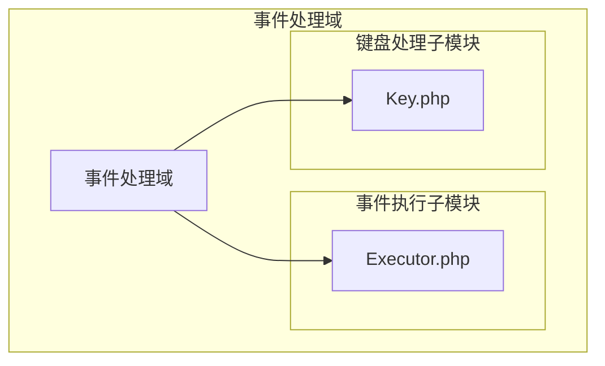

### 4.3 组件职责划分

**UI组件管理域职责**：
- **交互控件**：响应用户操作，触发事件，维护状态
- **数据输入控件**：提供文本和数值输入能力，支持验证和格式化
- **容器布局控件**：管理子控件的排列和组织，提供布局管理
- **显示反馈控件**：呈现信息和状态，提供界面美化

**图形渲染域职责**：
- **绘图路径**：定义绘图路径和线条样式，支持几何绘制
- **色彩画刷**：管理颜色填充和渐变效果，提供填充样式
- **文本渲染**：提供字体管理、文本排版和文本对齐功能
- **变换矩阵**：支持坐标变换、缩放旋转和仿射变换

**窗口管理域职责**：
- **窗口管理**：负责窗口创建、生命周期管理和属性管理
- **区域控件**：定义绘制区域，管理控件层次，控制重绘
- **框架协调**：负责框架初始化、全局状态管理和系统协调
- **几何数据**：提供坐标表示、尺寸定义和几何计算

**事件处理域职责**：
- **事件执行**：负责事件分发、处理器调用和异步事件处理
- **键盘处理**：处理键盘输入、按键映射和快捷键

### 4.4 组件交互关系

**组件交互流程**：

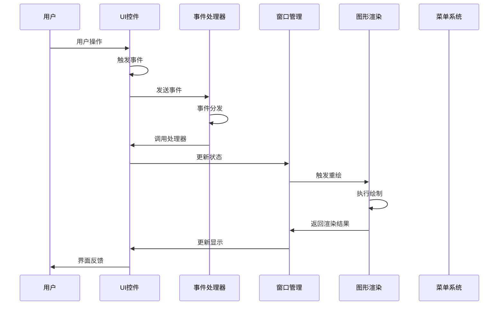

## 5. 关键流程 (Key Processes)

### 5.1 核心功能流程

#### 窗口创建与初始化流程

**流程说明**：从创建窗口实例开始，通过配置菜单栏、添加UI控件、建立绘制区域，最终显示窗口并进入事件循环。

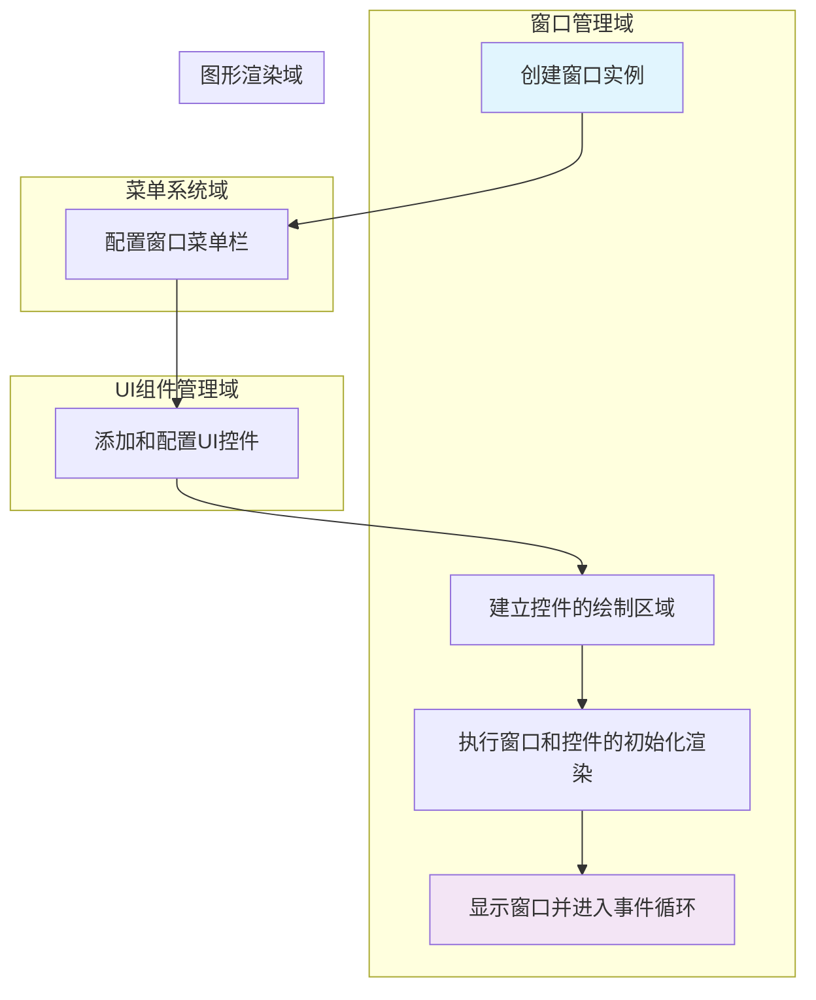

**详细流程**：
1. **创建窗口实例**：Window.php创建主窗口实例，初始化基本属性
2. **配置窗口菜单栏**：Menu.php、MenuItem.php配置菜单栏结构和项目
3. **添加和配置UI控件**：Controls/*.php添加各种UI控件并设置属性
4. **建立绘制区域**：Area.php建立控件的绘制区域，管理控件层次
5. **初始化渲染**：Draw/*.php执行窗口和控件的初始化渲染
6. **进入事件循环**：启动事件处理机制，等待用户交互

#### UI交互处理流程

**流程说明**：用户通过各种UI控件与应用程序进行双向交互的完整流程。

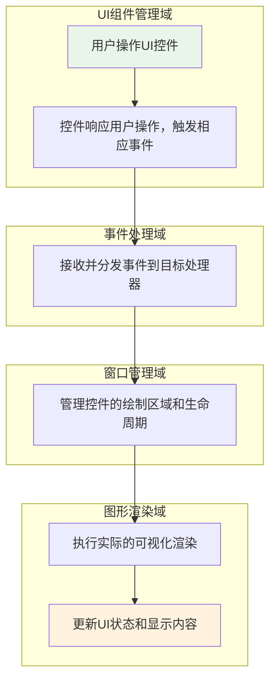

**详细流程**：
1. **用户操作**：用户在UI控件上进行点击、输入等操作
2. **触发事件**：控件响应操作并触发相应的事件
3. **事件分发**：Executor.php接收并分发事件到目标处理器
4. **区域管理**：Area.php、Control.php管理控件的绘制区域和生命周期
5. **可视化渲染**：Draw/*.php执行实际的可视化渲染
6. **状态更新**：更新UI状态和显示内容，呈现给用户

#### 图形绘制与渲染流程

**流程说明**：根据用户操作或程序逻辑触发重绘请求，通过配置绘制参数和样式，执行具体的图形和文本绘制操作。

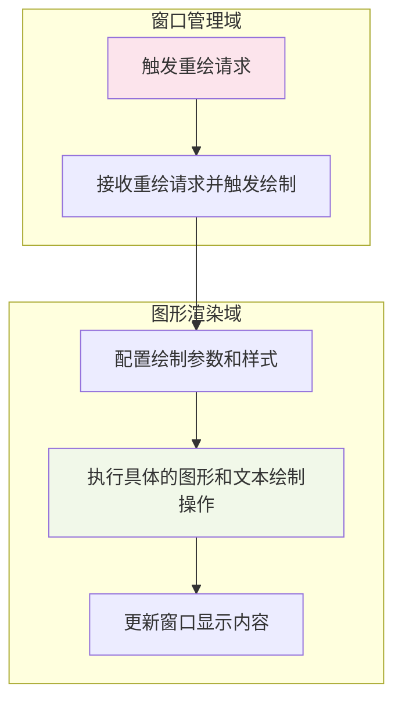

**详细流程**：
1. **触发重绘**：Window.php、Control.php接收重绘请求
2. **触发绘制**：窗口管理系统触发绘制过程
3. **配置参数**：Draw/Path.php、Draw/Pen.php、Draw/Brush/*.php配置绘制参数和样式
4. **执行绘制**：Draw/Text/*.php、Draw/Color.php、Draw/Matrix.php执行具体的图形和文本绘制操作
5. **更新显示**：更新窗口显示内容

### 5.2 技术处理流程

#### 事件处理机制

**事件流图**：

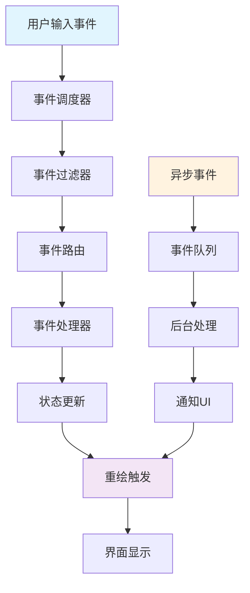

#### 绘图渲染管线

**渲染管线图**：

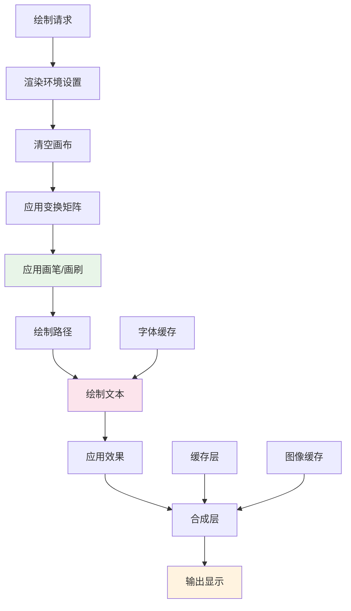

### 5.3 数据流转路径

#### UI状态管理流程

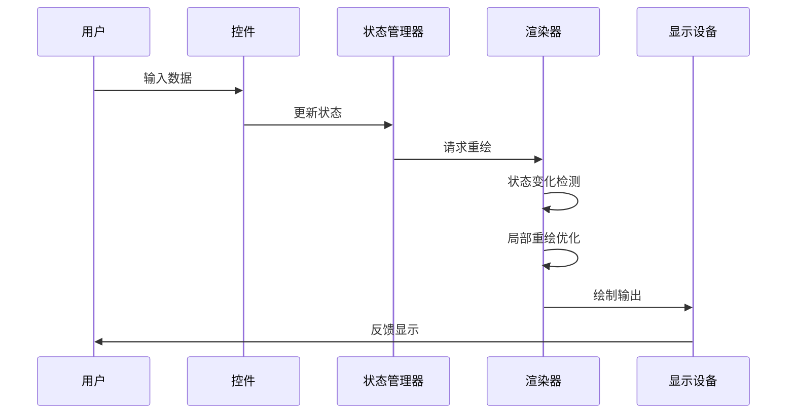

#### 事件传播路径

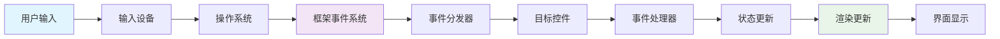

## 6. 技术实现 (Technical Implementation)

### 6.1 核心模块实现

#### UI组件管理域实现细节

**交互控件实现模式**：

```php
// 交互控件基础接口
interface InteractiveControl {
    public function handleEvent(Event $event): void;
    public function setState(ControlState $state): void;
    public function getState(): ControlState;
    public function triggerEvent(string $eventType): void;
}

// 按钮控件实现示例
class Button implements InteractiveControl {
    private $state;
    private $eventHandlers = [];
    
    public function handleEvent(Event $event): void {
        switch ($event->getType()) {
            case 'click':
                $this->onClick($event);
                break;
            case 'hover':
                $this->onHover($event);
                break;
        }
    }
    
    private function onClick(Event $event): void {
        $this->setState(new PressedState());
        $this->triggerEvent('button_clicked');
    }
    
    public function triggerEvent(string $eventType): void {
        if (isset($this->eventHandlers[$eventType])) {
            foreach ($this->eventHandlers[$eventType] as $handler) {
                $handler->execute($event);
            }
        }
    }
}
```

**容器布局控件实现模式**：

```php
// 容器控件基类
abstract class ContainerControl extends Control {
    protected $children = [];
    protected $layoutManager;
    
    public function addChild(Control $child): void {
        $this->children[] = $child;
        $child->setParent($this);
        $this->invalidate();
    }
    
    public function removeChild(Control $child): void {
        $key = array_search($child, $this->children);
        if ($key !== false) {
            array_splice($this->children, $key, 1);
            $child->setParent(null);
            $this->invalidate();
        }
    }
    
    public function layout(): void {
        if ($this->layoutManager) {
            $this->layoutManager->layout($this->children, $this->getBounds());
        }
    }
}

// 网格布局实现
class GridLayout implements LayoutManager {
    public function layout(array $children, Rect $container): void {
        $rows = $this->getRowCount();
        $cols = $this->getColumnCount();
        $cellWidth = $container->width / $cols;
        $cellHeight = $container->height / $rows;
        
        foreach ($children as $index => $child) {
            $row = intdiv($index, $cols);
            $col = $index % $cols;
            
            $x = $col * $cellWidth;
            $y = $row * $cellHeight;
            
            $child->setBounds(new Rect($x, $y, $cellWidth, $cellHeight));
        }
    }
}
```

#### 图形渲染域实现细节

**绘图路径实现**：

```php
class Path {
    private $commands = [];
    private $currentPoint;
    
    public function moveTo(float $x, float $y): void {
        $this->commands[] = ['type' => 'move', 'x' => $x, 'y' => $y];
        $this->currentPoint = ['x' => $x, 'y' => $y];
    }
    
    public function lineTo(float $x, float $y): void {
        $this->commands[] = ['type' => 'line', 'x' => $x, 'y' => $y];
        $this->currentPoint = ['x' => $x, 'y' => $y];
    }
    
    public function bezierCurveTo(
        float $control1X, float $control1Y,
        float $control2X, float $control2Y,
        float $endX, float $endY
    ): void {
        $this->commands[] = [
            'type' => 'bezier',
            'control1' => ['x' => $control1X, 'y' => $control1Y],
            'control2' => ['x' => $control2X, 'y' => $control2Y],
            'end' => ['x' => $endX, 'y' => $endY]
        ];
        $this->currentPoint = ['x' => $endX, 'y' => $endY];
    }
    
    public function close(): void {
        $this->commands[] = ['type' => 'close'];
    }
    
    public function render(Renderer $renderer, Stroke $stroke, Brush $brush): void {
        $renderer->beginPath();
        
        foreach ($this->commands as $command) {
            switch ($command['type']) {
                case 'move':
                    $renderer->moveTo($command['x'], $command['y']);
                    break;
                case 'line':
                    $renderer->lineTo($command['x'], $command['y']);
                    break;
                case 'bezier':
                    $renderer->bezierCurveTo(
                        $command['control1']['x'], $command['control1']['y'],
                        $command['control2']['x'], $command['control2']['y'],
                        $command['end']['x'], $command['end']['y']
                    );
                    break;
                case 'close':
                    $renderer->closePath();
                    break;
            }
        }
        
        $renderer->setStroke($stroke);
        $renderer->setBrush($brush);
        $renderer->strokeAndFill();
    }
}
```

**文本渲染实现**：

```php
class TextLayout {
    private $text;
    private $font;
    private $bounds;
    private $lines = [];
    
    public function __construct(string $text, Font $font) {
        $this->text = $text;
        $this->font = $font;
        $this->layout();
    }
    
    private function layout(): void {
        $words = preg_split('/\s+/', $this->text);
        $this->lines = [];
        $currentLine = '';
        $currentWidth = 0;
        
        foreach ($words as $word) {
            $wordWidth = $this->font->measureText($word);
            
            if ($currentWidth + $wordWidth > $this->getMaxWidth()) {
                if (!empty($currentLine)) {
                    $this->lines[] = $currentLine;
                    $currentLine = $word;
                    $currentWidth = $wordWidth;
                } else {
                    $this->lines[] = $word;
                    $currentWidth = 0;
                }
            } else {
                $currentLine .= (empty($currentLine) ? '' : ' ') . $word;
                $currentWidth += $wordWidth + $this->font->measureText(' ');
            }
        }
        
        if (!empty($currentLine)) {
            $this->lines[] = $currentLine;
        }
    }
    
    public function render(Renderer $renderer, Point $position): void {
        $y = $position->getY();
        
        foreach ($this->lines as $line) {
            $lineWidth = $this->font->measureText($line);
            $x = $position->getX() + ($this->getMaxWidth() - $lineWidth) / 2;
            
            $renderer->drawText($line, $x, $y, $this->font);
            $y += $this->font->getLineHeight();
        }
    }
}
```

#### 窗口管理域实现细节

```php
class Window {
    private $title;
    private $width;
    private $height;
    private $controls = [];
    private $menuBar;
    private $eventLoop;
    
    public function __construct(string $title, int $width, int $height) {
        $this->title = $title;
        $this->width = $width;
        $this->height = $height;
        $this->eventLoop = new EventLoop();
    }
    
    public function addControl(Control $control): void {
        $control->setWindow($this);
        $control->setBounds(new Rect(0, 0, $this->width, $this->height));
        $this->controls[] = $control;
    }
    
    public function setMenuBar(MenuBar $menuBar): void {
        $this->menuBar = $menuBar;
        $menuBar->setWindow($this);
    }
    
    public function show(): void {
        $this->initialize();
        $this->eventLoop->run();
    }
    
    private function initialize(): void {
        // 初始化渲染系统
        RendererFactory::initialize();
        
        // 创建窗口
        $this->nativeWindow = NativeWindowFactory::create($this->title, $this->width, $this->height);
        
        // 设置事件处理器
        $this->setupEventHandlers();
        
        // 初始渲染
        $this->render();
    }
    
    private function setupEventHandlers(): void {
        $this->nativeWindow->onClose(function() {
            $this->eventLoop->stop();
        });
        
        $this->nativeWindow->onResize(function($width, $height) {
            $this->width = $width;
            $this->height = $height;
            $this->invalidate();
        });
        
        $this->nativeWindow->onPaint(function($context) {
            $this->render($context);
        });
    }
    
    private function render(PaintContext $context = null): void {
        $renderer = RendererFactory::create($context);
        
        // 清空窗口
        $renderer->clear(new Color(255, 255, 255));
        
        // 绘制菜单栏
        if ($this->menuBar) {
            $this->menuBar->render($renderer);
        }
        
        // 绘制控件
        foreach ($this->controls as $control) {
            $control->render($renderer);
        }
        
        // 提交渲染
        $renderer->present();
    }
    
    public function invalidate(): void {
        $this->nativeWindow->invalidate();
    }
}
```

### 6.2 关键算法设计

#### 控件布局算法

**网格布局算法**：

```php
class GridLayoutAlgorithm {
    public function calculateLayout(array $controls, Rect $container, GridConstraints $constraints): Rect[] {
        $layout = [];
        
        // 计算列宽
        $columnWidths = $this->calculateColumnWidths($controls, $container, $constraints);
        
        // 计算行高
        $rowHeights = $this->calculateRowHeights($controls, $container, $constraints);
        
        // 计算每个控件的位置和大小
        foreach ($controls as $control) {
            $gridConstraints = $constraints->getConstraints($control);
            
            $x = $this->calculateX($gridConstraints->getColumn(), $columnWidths);
            $y = $this->calculateY($gridConstraints->getRow(), $rowHeights);
            $width = $this->calculateWidth($gridConstraints->getColumnSpan(), $columnWidths);
            $height = $this->calculateHeight($gridConstraints->getRowSpan(), $rowHeights);
            
            $layout[$control] = new Rect($x, $y, $width, $height);
        }
        
        return $layout;
    }
    
    private function calculateColumnWidths(array $controls, Rect $container, GridConstraints $constraints): array {
        $maxColumn = $this->findMaxColumn($controls, $constraints);
        $columnWidths = array_fill(0, $maxColumn + 1, 0);
        
        foreach ($controls as $control) {
            $gridConstraints = $constraints->getConstraints($control);
            $preferredSize = $control->getPreferredSize();
            $columnSpan = $gridConstraints->getColumnSpan();
            
            $widthPerColumn = $preferredSize->getWidth() / $columnSpan;
            $startColumn = $gridConstraints->getColumn();
            
            for ($i = 0; $i < $columnSpan; $i++) {
                $columnWidths[$startColumn + $i] = max(
                    $columnWidths[$startColumn + $i], 
                    $widthPerColumn
                );
            }
        }
        
        // 应用填充和间距
        $totalSpacing = ($maxColumn + 1) * $constraints->getHgap();
        $availableWidth = $container->getWidth() - $totalSpacing;
        $scaleFactor = $availableWidth / array_sum($columnWidths);
        
        foreach ($columnWidths as &$width) {
            $width *= $scaleFactor;
        }
        
        return $columnWidths;
    }
}
```

#### 图形渲染优化算法

**脏矩形算法**：

```php
class DirtyRegionManager {
    private $dirtyRegions = [];
    private $cumulativeRegion;
    
    public function addDirtyRegion(Rect $region): void {
        $this->dirtyRegions[] = $region;
        $this->cumulativeRegion = $this->mergeRegions($this->cumulativeRegion, $region);
    }
    
    public function getDirtyRegions(): array {
        return $this->dirtyRegions;
    }
    
    public function getCumulativeRegion(): Rect {
        return $this->cumulativeRegion;
    }
    
    public function clear(): void {
        $this->dirtyRegions = [];
        $this->cumulativeRegion = null;
    }
    
    private function mergeRegions(?Rect $region1, Rect $region2): Rect {
        if ($region1 === null) {
            return $region2;
        }
        
        $x1 = min($region1->getX(), $region2->getX());
        $y1 = min($region1->getY(), $region2->getY());
        $x2 = max($region1->getX() + $region1->getWidth(), $region2->getX() + $region2->getWidth());
        $y2 = max($region1->getY() + $region1->getHeight(), $region2->getY() + $region2->getHeight());
        
        return new Rect($x1, $y1, $x2 - $x1, $y2 - $y1);
    }
}
```

### 6.3 数据结构设计

#### 几何数据结构

```php
// 点结构
class Point {
    private $x;
    private $y;
    
    public function __construct(float $x, float $y) {
        $this->x = $x;
        $this->y = $y;
    }
    
    public function getX(): float {
        return $this->x;
    }
    
    public function getY(): float {
        return $this->y;
    }
    
    public function translate(float $dx, float $dy): Point {
        return new Point($this->x + $dx, $this->y + $dy);
    }
    
    public function transform(Matrix $matrix): Point {
        $transformed = $matrix->transformPoint($this->x, $this->y);
        return new Point($transformed['x'], $transformed['y']);
    }
}

// 矩形结构
class Rect {
    private $x;
    private $y;
    private $width;
    private $height;
    
    public function __construct(float $x, float $y, float $width, float $height) {
        $this->x = $x;
        $this->y = $y;
        $this->width = $width;
        $this->height = $height;
    }
    
    public function contains(Point $point): bool {
        return $point->getX() >= $this->x &&
               $point->getX() <= $this->x + $this->width &&
               $point->getY() >= $this->y &&
               $point->getY() <= $this->y + $this->height;
    }
    
    public function intersects(Rect $other): bool {
        return !($this->x + $this->width < $other->x ||
                $other->x + $other->width < $this->x ||
                $this->y + $this->height < $other->y ||
                $other->y + $other->height < $this->y);
    }
    
    public function union(Rect $other): Rect {
        $x1 = min($this->x, $other->x);
        $y1 = min($this->y, $other->y);
        $x2 = max($this->x + $this->width, $other->x + $other->width);
        $y2 = max($this->y + $this->height, $other->y + $other->height);
        
        return new Rect($x1, $y1, $x2 - $x1, $y2 - $y1);
    }
}
```

#### 事件系统数据结构

```php
// 事件基类
abstract class Event {
    private $type;
    private $source;
    private $timestamp;
    private $propagationStopped = false;
    
    public function __construct(string $type, $source) {
        $this->type = $type;
        $this->source = $source;
        $this->timestamp = microtime(true);
    }
    
    public function getType(): string {
        return $this->type;
    }
    
    public function getSource() {
        return $this->source;
    }
    
    public function getTimestamp(): float {
        return $this->timestamp;
    }
    
    public function stopPropagation(): void {
        $this->propagationStopped = true;
    }
    
    public function isPropagationStopped(): bool {
        return $this->propagationStopped;
    }
}

// 鼠标事件
class MouseEvent extends Event {
    private $x;
    private $y;
    private $button;
    private $clickCount;
    
    public function __construct(string $type, $source, float $x, float $y, int $button, int $clickCount = 1) {
        parent::__construct($type, $source);
        $this->x = $x;
        $this->y = $y;
        $this->button = $button;
        $this->clickCount = $clickCount;
    }
    
    public function getX(): float {
        return $this->x;
    }
    
    public function getY(): float {
        return $this->y;
    }
    
    public function getButton(): int {
        return $this->button;
    }
    
    public function getClickCount(): int {
        return $this->clickCount;
    }
}

// 键盘事件
class KeyEvent extends Event {
    private $keyCode;
    private $keyChar;
    private $modifiers;
    
    public function __construct(string $type, $source, int $keyCode, ?string $keyChar, int $modifiers = 0) {
        parent::__construct($type, $source);
        $this->keyCode = $keyCode;
        $this->keyChar = $keyChar;
        $this->modifiers = $modifiers;
    }
    
    public function getKeyCode(): int {
        return $this->keyCode;
    }
    
    public function getKeyChar(): ?string {
        return $this->keyChar;
    }
    
    public function getModifiers(): int {
        return $this->modifiers;
    }
    
    public function isCtrlPressed(): bool {
        return ($this->modifiers & Modifier::CTRL) !== 0;
    }
    
    public function isShiftPressed(): bool {
        return ($this->modifiers & Modifier::SHIFT) !== 0;
    }
    
    public function isAltPressed(): bool {
        return ($this->modifiers & Modifier::ALT) !== 0;
    }
}
```

### 6.4 性能优化策略

#### 渲染性能优化

**双缓冲技术**：

```php
class DoubleBufferRenderer implements Renderer {
    private $frontBuffer;
    private $backBuffer;
    private $currentBuffer;
    
    public function __construct(int $width, int $height) {
        $this->frontBuffer = new Image($width, $height);
        $this->backBuffer = new Image($width, $height);
        $this->currentBuffer = $this->backBuffer;
    }
    
    public function beginFrame(): void {
        $this->currentBuffer = $this->backBuffer;
        $this->currentBuffer->clear();
    }
    
    public function endFrame(): void {
        // 交换缓冲区
        $temp = $this->frontBuffer;
        $this->frontBuffer = $this->backBuffer;
        $this->backBuffer = $temp;
        
        // 显示到屏幕
        $this->displayBuffer($this->frontBuffer);
    }
    
    private function displayBuffer(Image $buffer): void {
        // 将缓冲区内容复制到屏幕
        $this->nativeRenderer->drawImage($buffer, 0, 0);
    }
}
```

**区域裁剪优化**：

```php
class RegionClip {
    private $clipRegions = [];
    
    public function setClipRegion(Rect $region): void {
        $this->clipRegions = [$region];
    }
    
    public function addClipRegion(Rect $region): void {
        $this->clipRegions[] = $region;
    }
    
    public function isVisible(Rect $bounds): bool {
        foreach ($this->clipRegions as $clipRegion) {
            if ($bounds->intersects($clipRegion)) {
                return true;
            }
        }
        return false;
    }
    
    public function getVisibleRegion(Rect $bounds): Rect {
        foreach ($this->clipRegions as $clipRegion) {
            $intersection = $this->intersect($bounds, $clipRegion);
            if ($intersection !== null) {
                return $intersection;
            }
        }
        return $bounds;
    }
    
    private function intersect(Rect $rect1, Rect $rect2): ?Rect {
        if (!$rect1->intersects($rect2)) {
            return null;
        }
        
        $x1 = max($rect1->getX(), $rect2->getX());
        $y1 = max($rect1->getY(), $rect2->getY());
        $x2 = min($rect1->getX() + $rect1->getWidth(), $rect2->getX() + $rect2->getWidth());
        $y2 = min($rect1->getY() + $rect1->getHeight(), $rect2->getY() + $rect2->getHeight());
        
        return new Rect($x1, $y1, $x2 - $x1, $y2 - $y1);
    }
}
```

#### 内存管理优化

**对象池模式**：

```php
class EventPool {
    private static $pool = [];
    private static $maxPoolSize = 100;
    
    public static function obtain(string $type, $source, ...$args): Event {
        if (!empty(self::$pool[$type])) {
            $event = array_pop(self::$pool[$type]);
            $event->reset($source, ...$args);
            return $event;
        }
        
        return new $type($source, ...$args);
    }
    
    public static function release(Event $event): void {
        $type = get_class($event);
        
        if (!isset(self::$pool[$type])) {
            self::$pool[$type] = [];
        }
        
        if (count(self::$pool[$type]) < self::$maxPoolSize) {
            self::$pool[$type][] = $event;
        }
    }
}
```

**弱引用缓存**：

```php
class FontCache {
    private static $cache = [];
    
    public static function getFont(string $family, float $size, int $style = Font::STYLE_NORMAL): Font {
        $key = self::generateKey($family, $size, $style);
        
        if (isset(self::$cache[$key])) {
            $font = self::$cache[$key];
            if ($font !== null) {
                return $font;
            }
        }
        
        $font = new Font($family, $size, $style);
        
        // 使用弱引用以便垃圾回收
        self::$cache[$key] = new WeakReference($font);
        
        return $font;
    }
    
    private static function generateKey(string $family, float $size, int $style): string {
        return sprintf("%s-%.1f-%d", $family, $size, $style);
    }
}
```

## 7. 部署架构 (Deployment Architecture)

### 7.1 运行环境要求

#### 基础环境要求

**PHP运行时要求**：
- PHP版本：7.4 或更高版本
- 必需扩展：GD扩展（图像处理）、JSON扩展（配置管理）
- 推荐扩展：PCRE扩展（正则表达式）、mbstring扩展（多字节字符串）

**操作系统支持**：
- **Windows 10/11**：通过Windows API或第三方GUI库支持
- **macOS 10.15+**：通过Cocoa框架支持
- **Linux**：通过GTK+ 3.0+或Qt 5.0+支持

**GUI工具包后端**：
- **GTK+后端**：主要Linux支持，推荐版本3.24+
- **Qt后端**：跨平台支持，推荐版本5.15+
- **Cocoa后端**：macOS原生支持

#### 开发环境配置

**开发工具链**：
```bash
# PHP环境检查
php --version
php -m | grep -E "(gd|json|pcre|mbstring)"

# GUI工具包安装 (Ubuntu/Debian)
sudo apt-get install libgtk-3-dev
sudo apt-get install qt5-default

# 开发依赖安装
composer install --dev
```

**IDE配置建议**：
- **PHPStorm**：配置PHP解释器和代码调试
- **VS Code**：安装PHP扩展和调试器
- **Xdebug**：用于本地开发和调试

### 7.2 部署拓扑结构

**单机部署架构**：

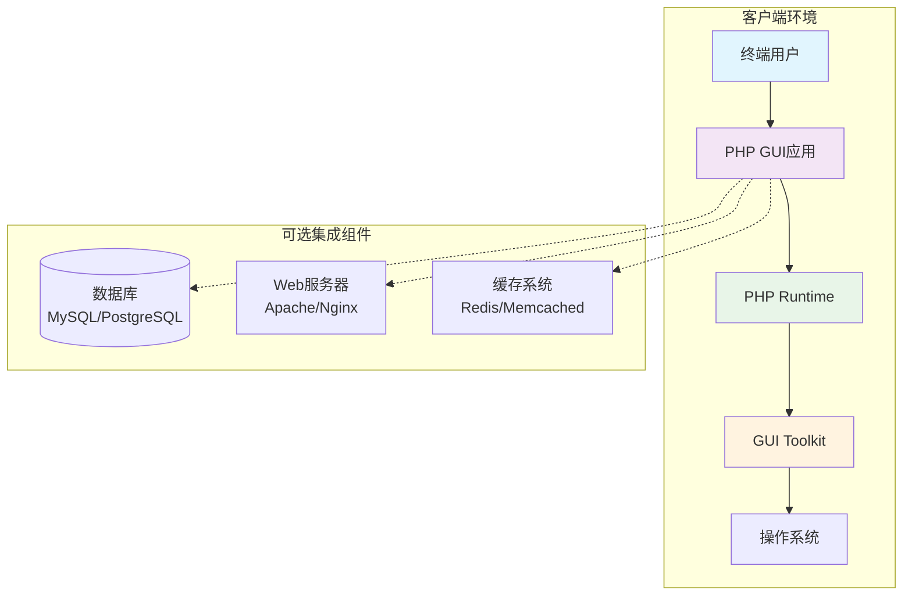

**开发部署架构**：

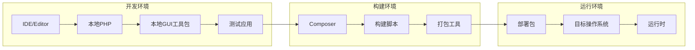

### 7.3 扩展性设计

#### 插件架构

**插件系统设计**：

```php
interface PluginInterface {
    public function getName(): string;
    public function getVersion(): string;
    public function initialize(Application $app): void;
    public function shutdown(): void;
}

// 插件管理器
class PluginManager {
    private $plugins = [];
    private $app;
    
    public function __construct(Application $app) {
        $this->app = $app;
    }
    
    public function loadPlugin(string $pluginClass): void {
        if (!class_exists($pluginClass)) {
            throw new PluginNotFoundException("Plugin class $pluginClass not found");
        }
        
        $reflection = new ReflectionClass($pluginClass);
        if (!$reflection->implementsInterface(PluginInterface::class)) {
            throw new InvalidPluginException("Plugin must implement PluginInterface");
        }
        
        $plugin = new $pluginClass();
        $plugin->initialize($this->app);
        $this->plugins[$plugin->getName()] = $plugin;
    }
    
    public function unloadPlugin(string $pluginName): void {
        if (isset($this->plugins[$pluginName])) {
            $this->plugins[$pluginName]->shutdown();
            unset($this->plugins[$pluginName]);
        }
    }
    
    public function getPlugin(string $pluginName): ?PluginInterface {
        return $this->plugins[$pluginName] ?? null;
    }
}
```

#### 主题系统

**主题扩展点**：

```php
interface ThemeInterface {
    public function getName(): string;
    public function getDisplayName(): string;
    public function getStyles(): array;
    public function getColors(): ColorScheme;
    public function getFonts(): FontScheme;
}

// 主题管理器
class ThemeManager {
    private $currentTheme;
    private $themes = [];
    
    public function registerTheme(ThemeInterface $theme): void {
        $this->themes[$theme->getName()] = $theme;
    }
    
    public function setTheme(string $themeName): void {
        if (!isset($this->themes[$themeName])) {
            throw new ThemeNotFoundException("Theme $themeName not found");
        }
        
        $this->currentTheme = $this->themes[$themeName];
        $this->applyTheme();
    }
    
    private function applyTheme(): void {
        $styleSheet = $this->generateStyleSheet($this->currentTheme);
        $this->app->getStyleManager()->loadStyleSheet($styleSheet);
    }
}
```

### 7.4 监控与运维

#### 性能监控

**性能指标收集**：

```php
class PerformanceMonitor {
    private $metrics = [];
    private $timers = [];
    
    public function startTimer(string $operation): void {
        $this->timers[$operation] = microtime(true);
    }
    
    public function endTimer(string $operation): float {
        if (!isset($this->timers[$operation])) {
            throw new TimerNotFoundException("Timer $operation not started");
        }
        
        $duration = microtime(true) - $this->timers[$operation];
        unset($this->timers[$operation]);
        
        $this->recordMetric($operation . '.duration', $duration);
        
        return $duration;
    }
    
    public function recordMetric(string $name, float $value): void {
        if (!isset($this->metrics[$name])) {
            $this->metrics[$name] = [];
        }
        
        $this->metrics[$name][] = [
            'value' => $value,
            'timestamp' => microtime(true)
        ];
        
        // 保持指标历史记录在合理范围内
        if (count($this->metrics[$name]) > 1000) {
            array_shift($this->metrics[$name]);
        }
    }
    
    public function getMetrics(): array {
        $summary = [];
        foreach ($this->metrics as $name => $values) {
            $summary[$name] = [
                'count' => count($values),
                'min' => min(array_column($values, 'value')),
                'max' => max(array_column($values, 'value')),
                'avg' => array_sum(array_column($values, 'value')) / count($values)
            ];
        }
        return $summary;
    }
}
```

#### 错误监控

**错误收集和处理**：

```php
class ErrorManager {
    private $errorHandlers = [];
    private $errorLog = [];
    
    public function registerErrorHandler(callable $handler): void {
        $this->errorHandlers[] = $handler;
    }
    
    public function handleError(Exception $error): void {
        $errorInfo = [
            'type' => get_class($error),
            'message' => $error->getMessage(),
            'file' => $error->getFile(),
            'line' => $error->getLine(),
            'trace' => $error->getTraceAsString(),
            'timestamp' => microtime(true)
        ];
        
        $this->errorLog[] = $errorInfo;
        
        foreach ($this->errorHandlers as $handler) {
            try {
                $handler($errorInfo);
            } catch (Exception $handlerError) {
                // 记录处理器错误但不中断主流程
                error_log("Error in error handler: " . $handlerError->getMessage());
            }
        }
        
        // 保持错误日志在合理范围内
        if (count($this->errorLog) > 100) {
            array_shift($this->errorLog);
        }
    }
    
    public function getRecentErrors(int $count = 10): array {
        return array_slice($this->errorLog, -$count);
    }
}
```

#### 日志系统

**统一日志管理**：

```php
class Logger {
    const LEVEL_DEBUG = 0;
    const LEVEL_INFO = 1;
    const LEVEL_WARNING = 2;
    const LEVEL_ERROR = 3;
    
    private $logFile;
    private $minLevel;
    
    public function __construct(string $logFile, int $minLevel = self::LEVEL_INFO) {
        $this->logFile = $logFile;
        $this->minLevel = $minLevel;
    }
    
    public function debug(string $message, array $context = []): void {
        $this->log(self::LEVEL_DEBUG, $message, $context);
    }
    
    public function info(string $message, array $context = []): void {
        $this->log(self::LEVEL_INFO, $message, $context);
    }
    
    public function warning(string $message, array $context = []): void {
        $this->log(self::LEVEL_WARNING, $message, $context);
    }
    
    public function error(string $message, array $context = []): void {
        $this->log(self::LEVEL_ERROR, $message, $context);
    }
    
    private function log(int $level, string $message, array $context = []): void {
        if ($level < $this->minLevel) {
            return;
        }
        
        $logEntry = [
            'timestamp' => date('Y-m-d H:i:s'),
            'level' => $this->levelToString($level),
            'message' => $message,
            'context' => $context
        ];
        
        $logLine = $this->formatLogEntry($logEntry);
        file_put_contents($this->logFile, $logLine . PHP_EOL, FILE_APPEND | LOCK_EX);
    }
    
    private function levelToString(int $level): string {
        switch ($level) {
            case self::LEVEL_DEBUG: return 'DEBUG';
            case self::LEVEL_INFO: return 'INFO';
            case self::LEVEL_WARNING: return 'WARNING';
            case self::LEVEL_ERROR: return 'ERROR';
            default: return 'UNKNOWN';
        }
    }
    
    private function formatLogEntry(array $logEntry): string {
        $context = empty($logEntry['context']) ? '' : ' ' . json_encode($logEntry['context']);
        return sprintf("[%s] %s: %s%s",
            $logEntry['timestamp'],
            $logEntry['level'],
            $logEntry['message'],
            $context
        );
    }
}
```

## 8. 架构洞察与建议

### 8.1 扩展性设计

**插件扩展点**：
- **UI控件插件**：允许第三方开发自定义控件
- **主题插件**：提供可插拔的UI主题系统
- **渲染后端插件**：支持新的图形渲染后端
- **事件处理插件**：扩展事件处理机制

**扩展策略**：
```php
// 扩展点示例：自定义控件注册
class ControlRegistry {
    private static $controls = [];
    
    public static function registerControl(string $name, string $class): void {
        self::$controls[$name] = $class;
    }
    
    public static function createControl(string $name): ?Control {
        if (!isset(self::$controls[$name])) {
            return null;
        }
        
        $class = self::$controls[$name];
        return new $class();
    }
}
```

### 8.2 性能考虑

**性能瓶颈分析**：
1. **渲染性能**：复杂UI界面可能导致渲染延迟
2. **内存使用**：大量控件和图像资源可能占用过多内存
3. **事件处理**：频繁的用户交互可能影响响应性能

**优化策略**：
- **延迟加载**：按需加载UI控件和资源
- **脏矩形优化**：只重绘变更区域
- **对象池**：重用频繁创建的对象
- **缓存机制**：缓存计算结果和渲染数据

### 8.3 安全性设计

**安全机制**：
- **输入验证**：对用户输入进行严格验证
- **权限控制**：实现基于角色的功能访问控制
- **沙盒执行**：在受限环境中执行第三方代码
- **资源限制**：限制内存和CPU使用

**防护措施**：
```php
class SecurityManager {
    public function validateInput(string $input): bool {
        // 防止代码注入
        if (preg_match('/[<>"\']/', $input)) {
            return false;
        }
        
        // 长度限制
        if (strlen($input) > 1000) {
            return false;
        }
        
        return true;
    }
    
    public function sandboxExecution(callable $function, array $allowedClasses = []): mixed {
        // 创建受限执行环境
        $restrictedFunction = function() use ($function, $allowedClasses) {
            // 限制可访问的类和函数
            $oldIncludePath = ini_set('include_path', '/restricted/path');
            // 执行函数
            $result = $function();
            ini_set('include_path', $oldIncludePath);
            return $result;
        };
        
        return $restrictedFunction();
    }
}
```

### 8.4 开发指导

**开发最佳实践**：
1. **模块化开发**：保持模块间的低耦合高内聚
2. **接口驱动**：优先设计接口再实现
3. **单元测试**：为每个模块编写充分的测试用例
4. **文档化**：及时更新API文档和架构文档

**架构决策记录**：

| 决策ID | 决策内容 | 决策原因 | 影响范围 |
|--------|----------|----------|----------|
| ADR-001 | 采用分层架构模式 | 便于维护和扩展，降低复杂度 | 全局架构 |
| ADR-002 | 事件驱动交互机制 | 提升响应性能和用户体验 | 交互层 |
| ADR-003 | 支持多种GUI后端 | 满足跨平台需求 | 渲染层 |
| ADR-004 | 插件化扩展设计 | 支持第三方扩展和定制 | 全局架构 |

### 8.5 运维指导

**部署检查清单**：
- [ ] 确认PHP版本和必需扩展
- [ ] 安装并配置GUI工具包后端
- [ ] 设置适当的文件和目录权限
- [ ] 配置日志目录和权限
- [ ] 验证字体和图像资源路径
- [ ] 测试应用程序基本功能

**监控指标**：
- **响应时间**：UI交互响应时间
- **内存使用**：应用程序内存占用
- **错误率**：异常和错误发生频率
- **资源使用**：CPU和GPU使用率

**故障排除**：
- **启动失败**：检查PHP环境、GUI工具包、文件权限
- **渲染异常**：验证图形驱动、字体配置、内存不足
- **性能问题**：分析渲染性能、内存泄漏、事件处理延迟
- **兼容性**：检查操作系统版本、依赖库版本

## 9. 总结

PHP GUI Framework通过**分层架构模式**和**组件化设计**，为PHP开发者提供了完整的桌面应用开发能力。该框架具有以下特点：

**架构优势**：
- **清晰的层次分离**：表现层、渲染层、核心层、交互层和基础设施层职责明确
- **模块化设计**：6个核心领域模块独立开发、测试和部署
- **事件驱动**：基于事件的交互机制，提供良好的用户体验
- **可扩展性**：支持插件化扩展和主题定制
- **跨平台支持**：通过GUI工具包后端实现跨平台兼容性

**技术特色**：
- **丰富的组件库**：17+种UI控件覆盖主流GUI需求
- **强大的绘图系统**：完整的2D图形渲染能力
- **性能优化**：双缓冲、脏矩形、对象池等优化技术
- **安全机制**：输入验证、沙盒执行、资源限制

**适用场景**：
- PHP桌面工具开发
- 企业内部管理系统客户端
- GUI编程教学和演示
- 快速原型和概念验证

该架构文档为开发团队提供了完整的技术指导，为技术决策提供了有力支撑，并为系统的维护和演进奠定了坚实基础。通过遵循文档中的架构原则和最佳实践，可以确保系统的长期可维护性和可扩展性。

---

**文档版本**: v1.0  
**最后更新**: 2025-06-16T16:25:46Z  
**维护人员**: 架构团队  
**审核状态**: 已审核