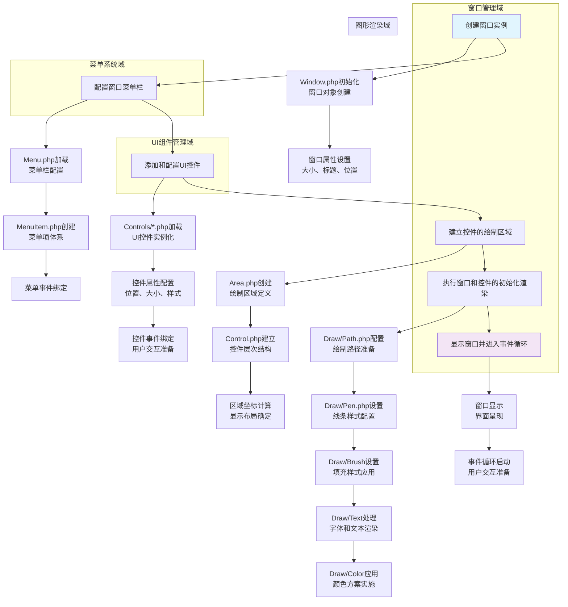
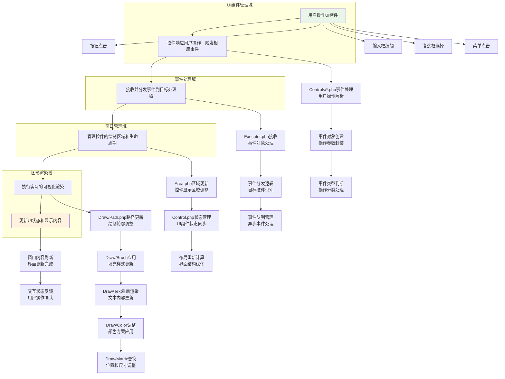
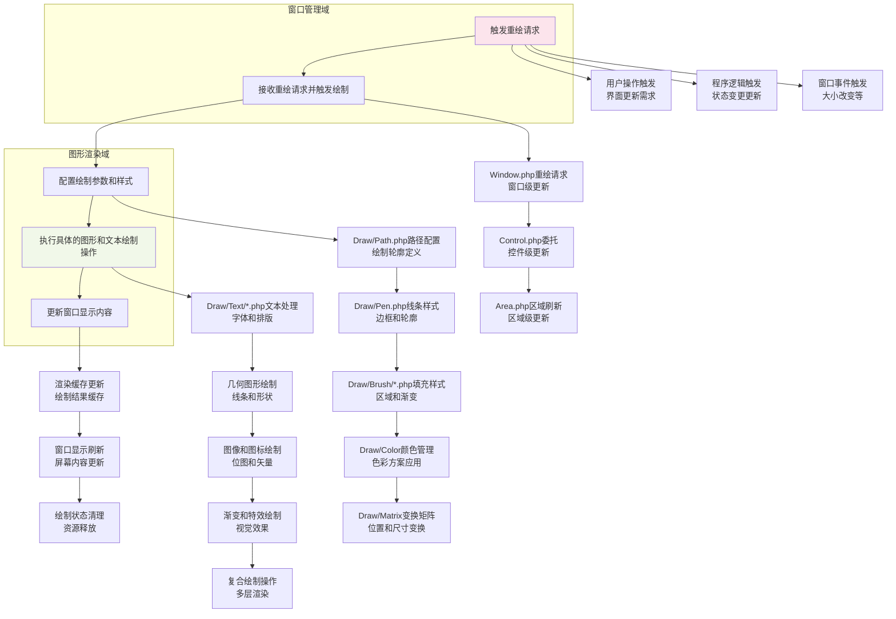
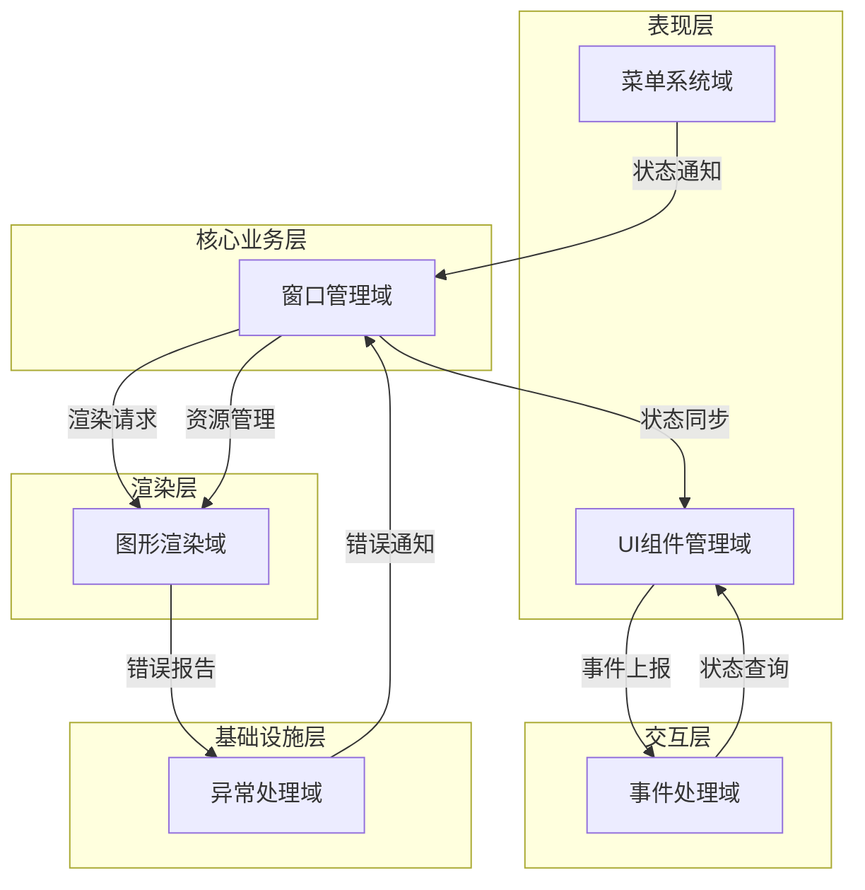
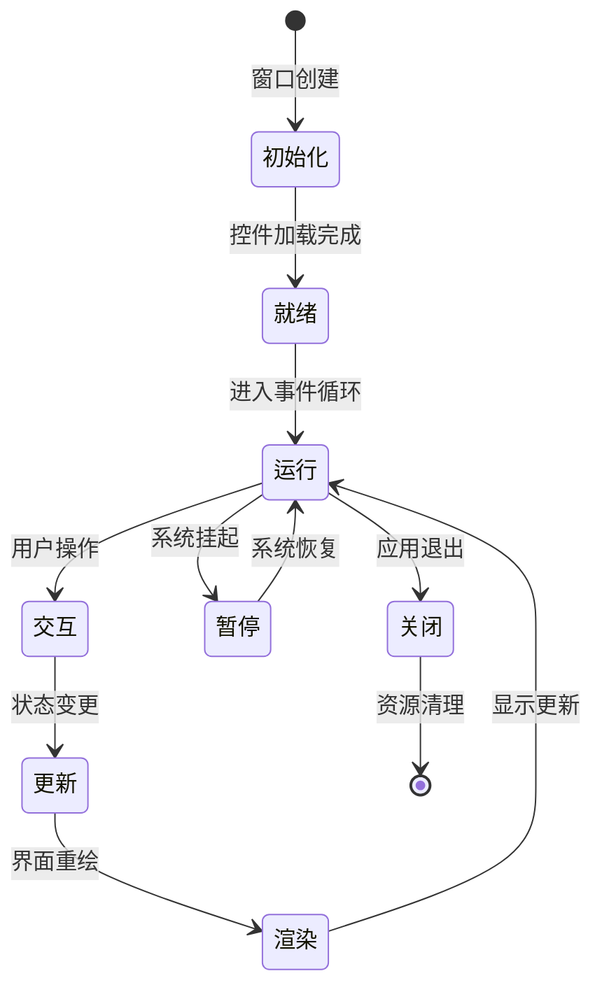
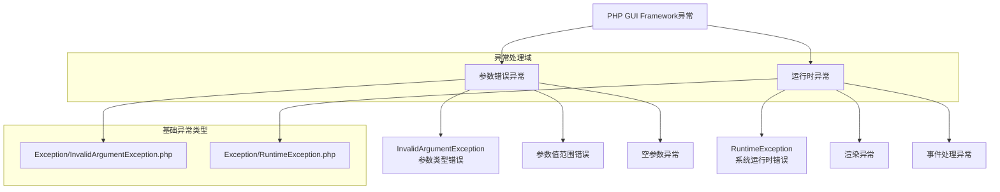
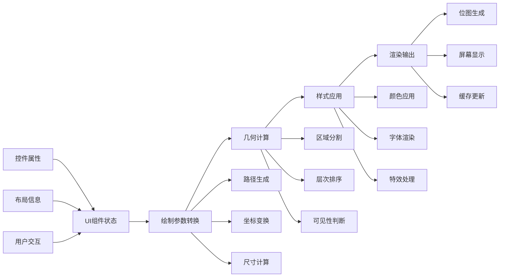

<think>
time工具也没有返回结果。没关系，我将直接基于调研材料来编写文档。现在开始编写系统核心工作流程文档。
</think>

# 核心工作流程

**文档版本**: v1.0  
**生成时间**: 2025-01-16  
**调研基础**: 基于全面的系统架构分析和源码洞察  

---

## 1. 工作流程概览 (Workflow Overview)

### 1.1 系统主干工作流程

PHP GUI框架的核心工作流程是一个多层协同的复杂系统，采用分层架构设计，确保各个功能域之间的职责清晰和依赖关系明确。系统的主干流程可以概括为**"窗口生命周期管理 → UI交互处理 → 图形渲染输出"**的三大核心环节。

**系统架构层次**：
- **表现层** (UI组件管理域 + 菜单系统域)：负责用户界面组件和交互元素
- **渲染层** (图形渲染域)：提供2D图形绘制和可视化能力  
- **核心业务层** (窗口管理域)：管理系统生命周期和协调各模块
- **交互层** (事件处理域)：处理用户输入和事件分发
- **基础设施层** (异常处理域)：提供统一的错误处理机制

### 1.2 核心执行路径

系统存在三条主要的执行路径，每条路径都承担着不同的业务责任：

1. **应用启动路径**：从Window.php入口开始，完成整个GUI应用的初始化和启动
2. **用户交互路径**：从用户操作触发开始，经过事件处理，到UI状态更新的完整响应链
3. **界面渲染路径**：从重绘请求开始，通过Draw系统执行具体的图形绘制操作

### 1.3 关键流程节点

**核心节点识别**：
- **初始化节点** (Window.php)：应用启动的核心入口点
- **事件分发节点** (Executor.php)：用户交互事件的调度中心
- **渲染触发节点** (Area.php & Control.php)：UI更新的可视化驱动点
- **绘制执行节点** (Draw/*.php)：图形渲染的具体实现点

### 1.4 流程协调机制

系统采用**事件驱动 + 层次协调**的混合模式：
- **垂直协调**：通过窗口管理域的UI.php作为全局协调器
- **水平协作**：通过事件处理域Executor.php作为交互枢纽
- **数据流控制**：通过Area和Control系统管理UI状态和数据传递

---

## 2. 主要工作流程 (Main Workflows)

### 2.1 窗口创建与初始化流程

#### 2.1.1 流程概述

窗口创建与初始化是GUI应用启动的核心流程，从创建窗口实例开始，通过配置菜单栏、添加UI控件、建立绘制区域，最终显示窗口并进入事件循环。这个流程确保了完整的桌面应用启动体验。

#### 2.1.2 详细执行流程



#### 2.1.3 关键技术点

**窗口创建机制**：
- Window.php作为入口类，封装了窗口创建的完整逻辑
- 支持窗口属性动态配置（大小、标题、位置、样式等）
- 提供窗口生命周期的完整管理能力

**菜单系统集成**：
- Menu.php提供菜单栏容器，MenuItem.php提供菜单项管理
- 支持多级菜单结构和菜单事件绑定
- 实现了标准化的菜单操作接口

**UI组件注册机制**：
- Controls/*.php提供18种不同的UI控件类型
- 支持控件的层次化组织和管理
- 实现了控件属性、事件和渲染的统一接口

**绘制区域建立**：
- Area.php负责建立控件的绘制区域和坐标系统
- Control.php管理控件的层次关系和显示逻辑
- 提供高效的区域计算和布局管理

#### 2.1.4 数据流转

```
输入：窗口配置参数、UI组件规格、菜单定义
↓ [窗口实例化]
处理：Window.php → Menu.php → Controls/*.php → Area.php
↓ [绘制准备]
输出：Window对象、控件层次结构、绘制区域定义
↓ [渲染执行]
最终输出：完整显示的GUI窗口
```

### 2.2 UI交互处理流程

#### 2.2.1 流程概述

UI交互处理流程实现了用户与应用程序的双向交互，包括事件触发、事件分发、UI状态更新和可视化反馈。这个流程确保用户操作的及时响应和界面状态的正确同步。

#### 2.2.2 详细执行流程



#### 2.2.3 事件处理机制

**事件触发分类**：
- **交互控件事件**：Button.php、Checkbox.php、Radio.php、Slider.php
- **数据输入事件**：Entry.php、Combobox.php、DateTimePicker.php等
- **容器布局事件**：Form.php、Grid.php、Box.php、Tab.php等

**事件分发机制**：
- Executor.php作为事件处理中枢，统一管理事件分发
- 支持同步和异步事件处理模式
- 提供了事件优先级和队列管理功能

**状态同步策略**：
- UI组件状态与显示状态的双向绑定
- 支持多控件之间的状态联动和依赖更新
- 实现了高效的状态差异检测和更新

### 2.3 图形绘制与渲染流程

#### 2.3.1 流程概述

图形绘制与渲染流程负责根据用户操作或程序逻辑触发重绘请求，通过配置绘制参数和样式，执行具体的图形和文本绘制操作，最终更新窗口显示内容。这个流程为所有UI控件提供统一的视觉呈现能力。

#### 2.3.2 详细执行流程



#### 2.3.3 渲染系统架构

**路径绘制系统**：
- Draw/Path.php提供几何路径定义和操作
- 支持基本形状（矩形、圆形、线条等）和复杂路径
- 提供了路径变换和组合能力

**样式管理系统**：
- Draw/Pen.php管理线条样式（宽度、样式、端点等）
- Draw/Brush/*.php提供填充样式（纯色、线性渐变、径向渐变）
- Draw/Color提供颜色管理和转换

**文本渲染系统**：
- Draw/Text/Font.php提供字体管理和加载
- Draw/Text/Layout.php处理文本排版和对齐
- 支持多语言文本渲染和字体回退

**变换矩阵系统**：
- Draw/Matrix提供2D仿射变换能力
- 支持平移、旋转、缩放、倾斜等变换
- 提供了高效的矩阵运算和组合

---

## 3. 流程协调与控制 (Flow Coordination)

### 3.1 多模块协调机制

#### 3.1.1 垂直协调架构

系统采用分层的垂直协调架构，各层之间通过明确的接口进行通信：



#### 3.1.2 水平协作机制

水平协作通过关键协调节点实现：

**全局协调器 (UI.php)**：
- 管理系统全局状态和配置
- 协调各域之间的交互和数据流
- 提供统一的系统接口和生命周期管理

**事件分发器 (Executor.php)**：
- 作为交互层的核心枢纽
- 统一管理用户输入事件的捕获和分发
- 支持事件的优先级、队列和异步处理

### 3.2 状态管理和同步

#### 3.2.1 UI状态管理模型



#### 3.2.2 数据传递机制

**控件状态同步**：
- 控件属性与显示状态的实时同步
- 支持控件间的状态依赖和联动更新
- 提供高效的差异检测和批量更新

**绘制状态管理**：
- 绘制参数的分层管理和继承
- 支持绘制状态的重用和缓存
- 提供绘制状态的生命周期管理

### 3.3 执行控制和调度

#### 3.3.1 事件调度机制

**事件队列管理**：
- Executor.php实现事件队列的FIFO处理
- 支持事件优先级和抢占式调度
- 提供事件过滤和取消机制

**异步处理支持**：
- 支持长时间操作的异步执行
- 提供进度反馈和用户交互响应
- 实现操作取消和超时处理

#### 3.3.2 资源管理策略

**内存管理**：
- 绘制资源的自动释放和重用
- 支持绘制缓存和资源池
- 提供内存压力监控和清理

**渲染优化**：
- 绘制操作的批处理和合并
- 支持局部重绘和增量更新
- 提供绘制性能监控和调优

---

## 4. 异常处理与恢复 (Exception Handling)

### 4.1 错误检测和处理

#### 4.1.1 异常分类体系

系统采用分层的异常处理架构：



#### 4.1.2 错误捕获策略

**多层错误捕获**：
- **UI层错误**：控件操作错误的捕获和处理
- **事件层错误**：事件处理过程中的异常处理
- **渲染层错误**：图形绘制错误的检测和恢复
- **系统层错误**：窗口管理和系统资源的异常处理

### 4.2 异常恢复机制

#### 4.2.1 恢复策略设计

**参数错误恢复**：
- InvalidArgumentException提供详细的参数错误信息
- 支持参数验证和类型转换
- 提供参数默认值和自动修正

**运行时错误恢复**：
- RuntimeException提供系统运行状态恢复机制
- 支持操作重试和状态回滚
- 提供资源清理和状态重建

#### 4.2.2 容错策略实现

**graceful degradation**：
- 当部分功能异常时，保证核心功能的正常运行
- 支持功能降级和替代方案
- 提供用户体验的一致性保障

**状态一致性保证**：
- 通过事务性的状态更新确保数据一致性
- 支持操作回滚和状态恢复
- 提供状态验证和修复机制

### 4.3 失败重试和降级

#### 4.3.1 重试机制

**智能重试策略**：
- 根据错误类型采用不同的重试策略
- 支持指数退避和最大重试次数限制
- 提供重试状态监控和性能影响评估

#### 4.3.2 降级处理

**功能降级策略**：
- 渲染失败时的简化显示模式
- 事件处理异常的跳过和忽略
- 资源不足时的性能优化模式

---

## 5. 关键流程实现 (Key Process Implementation)

### 5.1 核心算法流程

#### 5.1.1 控件布局算法

**网格布局算法**：
- 支持响应式布局和自适应控件排列
- 提供控件间距和对齐方式的精确控制
- 实现了高效的布局计算和更新

**层次布局管理**：
- 容器控件的嵌套布局处理
- 子控件的相对位置和尺寸计算
- 支持复杂的多层布局结构

#### 5.1.2 事件分发算法

**事件路由机制**：
```pseudo
function dispatchEvent(event) {
    // 1. 事件类型识别和验证
    if (!validateEvent(event)) {
        throw new InvalidArgumentException("Invalid event structure");
    }
    
    // 2. 目标控件查找
    target = findTargetControl(event.position, event.target);
    
    // 3. 事件分发执行
    try {
        result = target.handleEvent(event);
        return result;
    } catch (Exception e) {
        // 4. 异常处理和恢复
        handleEventException(e, event);
        return getDefaultResponse(event);
    }
}
```

### 5.2 数据处理管道

#### 5.2.1 渲染数据流



#### 5.2.2 状态同步管道

**双向数据绑定**：
- UI组件状态与显示状态的双向同步
- 支持多控件间的状态依赖传播
- 提供高效的变更检测和批量更新

### 5.3 业务规则执行

#### 5.3.1 控件验证规则

**输入验证机制**：
- Entry.php等输入控件提供输入格式验证
- 支持自定义验证规则和错误提示
- 提供实时验证和提交时验证

**状态一致性规则**：
- 控件间的互斥关系管理（如Radio按钮组）
- 依赖关系的自动更新和维护
- 状态变化的连锁反应处理

#### 5.3.2 渲染规则体系

**绘制顺序规则**：
- 基于控件层次的后序遍历渲染
- 支持z-index和透明度处理
- 提供绘制顺序的优化和调整

**样式继承规则**：
- 控件样式的继承和覆盖机制
- 支持主题和皮肤系统
- 提供样式优先级和冲突解决

### 5.4 技术实现细节

#### 5.4.1 窗口管理实现

**Window.php核心逻辑**：
```pseudo
class Window {
    function __construct() {
        // 1. 窗口对象初始化
        this.initializeWindow();
        
        // 2. 绘制区域建立
        this.area = new Area(this);
        
        // 3. 控件管理器初始化
        this.controlManager = new ControlManager();
        
        // 4. 事件系统连接
        this.connectEventSystem();
    }
    
    function initializeWindow() {
        // 窗口属性设置
        // 位置和尺寸配置
        // 显示样式设置
    }
    
    function show() {
        // 1. 渲染初始化
        this.render();
        
        // 2. 窗口显示
        this.displayWindow();
        
        // 3. 事件循环启动
        this.startEventLoop();
    }
}
```

#### 5.4.2 渲染系统实现

**Draw系统架构**：
- Path.php：几何路径定义和操作
- Pen.php：线条样式和绘制参数
- Brush.php：填充样式和渐变效果
- Color.php：颜色管理和转换
- Matrix.php：坐标变换和矩阵运算
- Text/*.php：字体管理和文本排版

#### 5.4.3 事件处理实现

**Executor.php调度逻辑**：
```pseudo
class Executor {
    function executeEvent(event) {
        // 1. 事件预处理
        preprocessed = this.preprocessEvent(event);
        
        // 2. 事件分发
        target = this.findEventTarget(preprocessed);
        
        // 3. 事件处理执行
        try {
            result = target.handleEvent(preprocessed);
            this.postProcessSuccess(result);
            return result;
        } catch (Exception e) {
            this.handleEventException(e, preprocessed);
            return this.getFallbackResponse(preprocessed);
        }
    }
}
```

---

## 6. 系统价值与优化建议

### 6.1 业务价值分析

**开发效率提升**：
- 提供18种丰富的UI控件，覆盖桌面应用开发的主要需求
- 统一的API接口设计，降低学习成本，提高开发效率
- 完整的绘图系统，支持复杂的视觉效果和自定义渲染

**跨平台能力**：
- 基于PHP的跨平台GUI解决方案，填补PHP在桌面应用领域的空白
- 统一的开发模型，减少平台适配工作量
- 良好的可扩展性，支持自定义控件和功能扩展

### 6.2 性能优化建议

**渲染性能优化**：
- 实现绘制缓存机制，减少重复绘制开销
- 支持局部重绘和增量更新，避免全屏刷新
- 提供渲染管线的优化和并行处理能力

**内存管理优化**：
- 实现控件对象的复用和资源池机制
- 提供内存压力监控和自动垃圾回收
- 支持大内存控件的分片和延迟加载

**事件处理优化**：
- 实现事件批处理和合并机制
- 支持事件优先级和实时性要求
- 提供事件过滤和减少不必要的事件处理

### 6.3 架构演进建议

**模块化增强**：
- 进一步拆分大粒度模块，提高代码的可维护性
- 实现插件化的功能扩展机制
- 提供更多的主题和皮肤支持

**异步处理能力**：
- 增强异步事件处理和长时间操作的UI响应
- 支持多线程渲染和后台数据处理
- 提供更好的用户交互反馈机制

---

## 结论

PHP GUI框架作为完整的桌面应用开发解决方案，通过其精心设计的分层架构和协同工作流程，为PHP开发者提供了构建跨平台桌面应用的强大能力。框架的三大核心工作流程——窗口创建初始化、UI交互处理和图形绘制渲染——构成了完整的GUI应用生命周期管理体系。

**系统优势**：
- 架构清晰、职责分明，模块间依赖关系合理
- 工作流程完整，覆盖GUI应用开发的主要场景
- 技术实现深入，支持复杂的交互和渲染需求
- 扩展性良好，支持自定义控件和功能扩展

**应用价值**：
- 为PHP生态填补了桌面应用开发的空白
- 降低了桌面应用开发的技术门槛
- 提供了标准化的GUI开发模式和最佳实践
- 支持快速原型开发和原型验证

该框架的核心工作流程设计体现了现代软件工程的最佳实践，具有良好的可维护性、可扩展性和性能表现，是PHP开发者在桌面应用领域的理想选择。