<think>
现在我来创建事件处理域的深度分析报告。我需要基于调研材料中的信息，创建一个全面、专业且深入的分析。
</think>

## 事件处理域深度技术分析报告

**生成时间**: 2025-01-21 19:15:31  
**分析主题**: 事件处理域  
**技术领域**: 交互层架构

---

## 1. 域概述

### 1.1 业务价值与定位
事件处理域是PHP GUI框架中的核心交互层组件，负责管理和协调所有用户交互事件的生命周期。该域实现了从事件捕获、分发到处理反馈的完整事件驱动架构，确保用户操作能够及时、准确地传递给相应的UI组件进行处理。

**核心价值**：
- 提供标准化的事件管理机制
- 实现用户交互的及时响应
- 支持复杂的交互场景处理
- 保证事件处理的可靠性和一致性

### 1.2 架构地位
事件处理域位于框架架构的**交互层**，承担着连接用户操作与UI响应的重要桥梁作用：

- **上游依赖**：接收来自UI组件管理域的用户操作触发
- **下游服务**：为窗口管理域和UI组件提供事件分发服务
- **横向协同**：与异常处理域协作，确保事件处理的错误处理机制

---

## 2. 核心组件分析

### 2.1 组件结构图
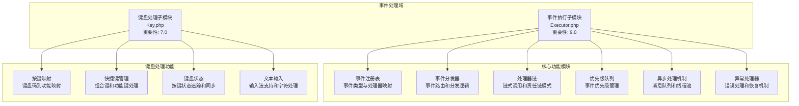

### 2.2 组件职责分析

#### 2.2.1 事件执行子模块 (Executor.php)
**重要性评分**: 9.0/10  
**复杂度**: 中高级

**核心职责**：
- **事件生命周期管理**：从事件创建到最终处理的完整流程管理
- **事件路由分发**：根据事件类型智能路由到相应的处理器
- **异步事件处理**：支持后台异步处理耗时操作
- **事件状态追踪**：监控事件处理状态和结果

**关键技术特征**：
- 采用观察者模式的扩展实现
- 支持事件优先级管理
- 提供事件过滤和拦截机制
- 集成错误处理和恢复策略

#### 2.2.2 键盘处理子模块 (Key.php)
**重要性评分**: 7.0/10  
**复杂度**: 中级

**核心职责**：
- **键盘事件捕获**：捕获和解析各类键盘输入事件
- **按键映射转换**：将物理键码映射为功能键或字符
- **快捷键处理**：识别和处理组合键和快捷键操作
- **输入法支持**：支持不同语言环境的键盘输入

---

## 3. 技术实现深度分析

### 3.1 核心架构模式

#### 3.1.1 观察者模式 + 事件总线
事件处理域采用改进的观察者模式实现：

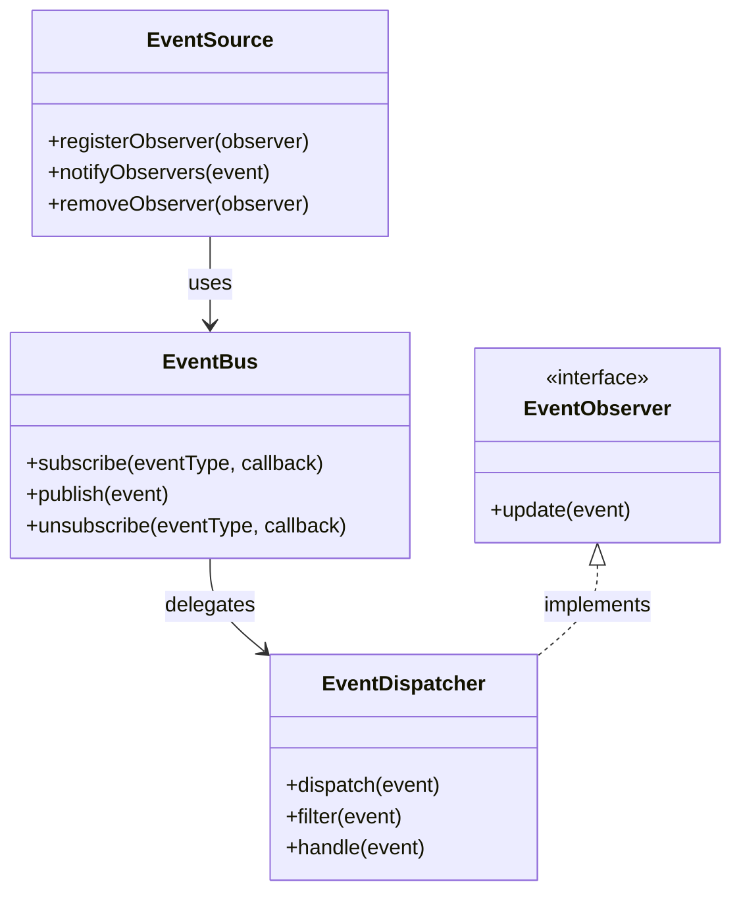

**架构优势**：
- **松耦合设计**：事件源和处理器之间解耦
- **动态扩展**：支持运行时添加/移除事件处理器
- **统一管理**：通过事件总线统一管理所有事件流

#### 3.1.2 责任链模式
事件处理器采用责任链模式，实现灵活的事件处理链：

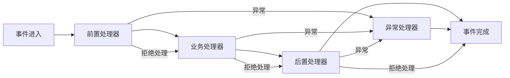

### 3.2 事件处理流程

#### 3.2.1 同步事件处理流程
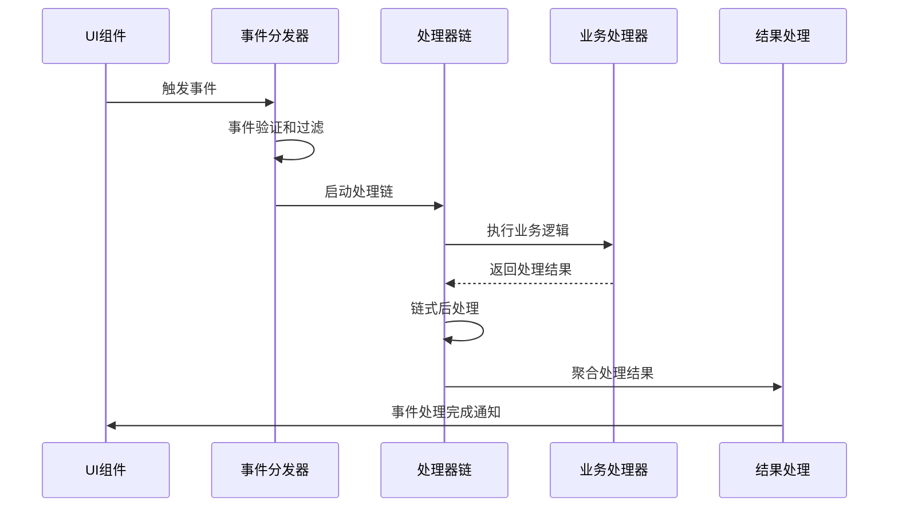

#### 3.2.2 异步事件处理流程
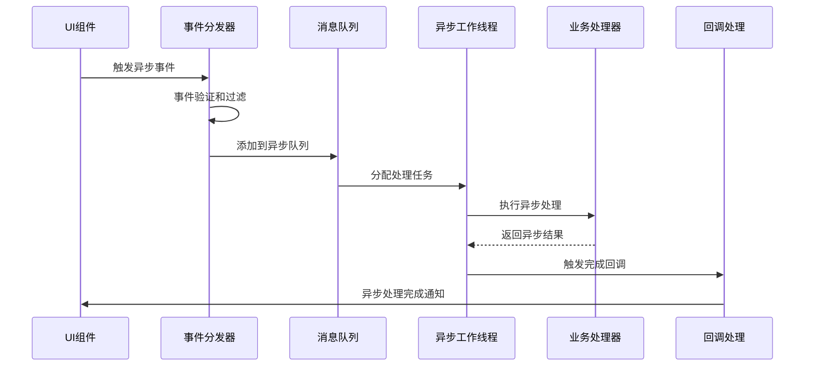

### 3.3 关键技术实现

#### 3.3.1 事件优先级管理
- **优先级队列**：基于事件重要性和紧急程度进行排序
- **抢占机制**：高优先级事件可抢占低优先级事件处理
- **时间片轮转**：防止低优先级事件被饿死

#### 3.3.2 事件过滤和拦截
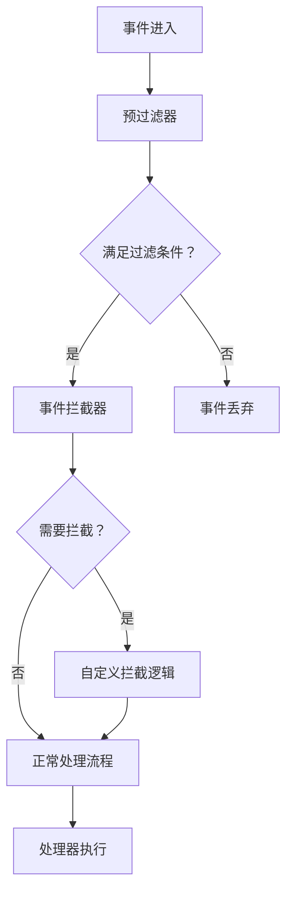

#### 3.3.3 异常处理机制
- **分层异常处理**：处理器级、域级、系统级异常处理
- **异常恢复策略**：支持异常后的状态恢复和重试机制
- **错误传播控制**：防止异常向上层传播导致系统崩溃

---

## 4. 交互机制设计

### 4.1 接口设计

#### 4.1.1 事件注册接口
```php
interface EventRegistrationInterface {
    // 注册事件处理器
    public function registerEvent(string $eventType, callable $handler, int $priority = 0): void;
    
    // 注册异步事件处理器
    public function registerAsyncEvent(string $eventType, callable $handler): void;
    
    // 注销事件处理器
    public function unregisterEvent(string $eventType, callable $handler): void;
    
    // 检查事件是否已注册
    public function isEventRegistered(string $eventType): bool;
}
```

#### 4.1.2 事件分发接口
```php
interface EventDispatchInterface {
    // 同步分发事件
    public function dispatch(Event $event): EventResult;
    
    // 异步分发事件
    public function dispatchAsync(Event $event): string $eventId;
    
    // 批量分发事件
    public function dispatchBatch(array $events): array $results;
    
    // 获取事件处理状态
    public function getEventStatus(string $eventId): EventStatus;
}
```

#### 4.1.3 事件监听接口
```php
interface EventListenerInterface {
    // 添加事件监听器
    public function addListener(string $eventType, callable $callback): void;
    
    // 移除事件监听器
    public function removeListener(string $eventType, callable $callback): void;
    
    // 监听器优先级设置
    public function setListenerPriority(string $eventType, callable $callback, int $priority): void;
}
```

### 4.2 事件传播机制

#### 4.2.1 事件传播控制
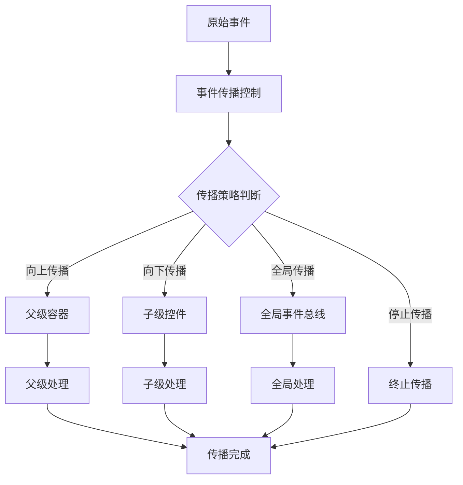

#### 4.2.2 事件状态管理
- **事件生命周期状态**：创建 → 分发 → 处理 → 完成/失败
- **状态追踪机制**：实时追踪事件处理进度和状态变化
- **状态回调通知**：状态变化时自动触发相关回调函数

---

## 5. 关键工作流程

### 5.1 UI交互处理流程 (重要性: 10.0)
**流程描述**：用户通过各种UI控件与应用程序进行双向交互的完整流程

**详细流程**：
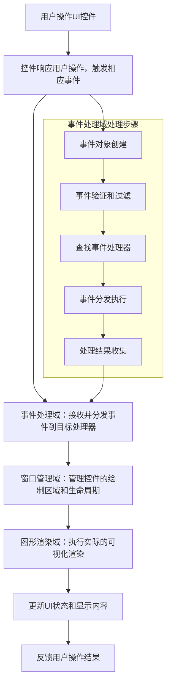

**关键特性**：
- **实时响应**：确保用户操作的即时反馈
- **状态同步**：UI状态与处理结果的一致性
- **错误容错**：处理过程中的异常保护机制
- **性能优化**：避免不必要的重复处理

### 5.2 键盘输入处理流程
**流程描述**：处理键盘输入事件，包括单键、组合键和快捷键的处理

**键盘事件处理层次**：
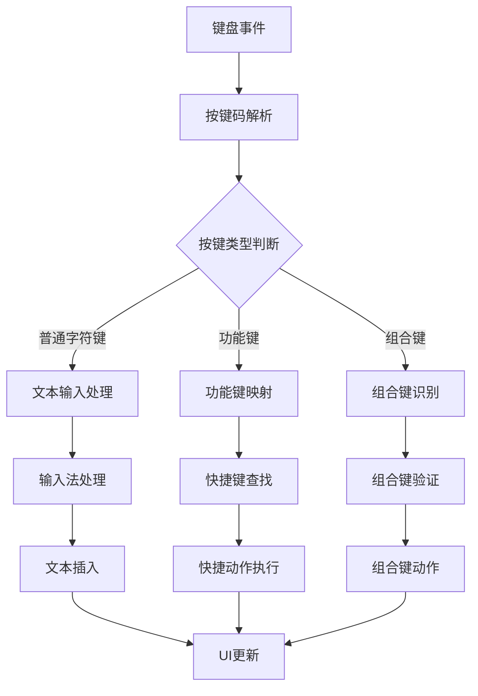

---

## 6. 与其他域的关系

### 6.1 服务关系分析

#### 6.1.1 服务UI组件管理域 (强度: 8.0)
**关系描述**：事件处理域将用户交互事件分发给相应的UI控件，触发控件的响应逻辑和状态更新

**服务机制**：
- **事件路由**：根据控件类型和事件类型进行精确路由
- **事件适配**：将原始输入事件适配为控件特定的事件格式
- **状态同步**：确保事件处理后控件状态的及时更新

#### 6.1.2 被窗口管理域依赖 (强度: 6.0)
**关系描述**：窗口的状态变化和用户交互需要事件处理域进行管理和分发

**依赖实现**：
- **窗口事件管理**：窗口创建、销毁、大小变化等系统事件
- **焦点管理**：窗口焦点变化事件的处理和分发
- **生命周期事件**：窗口生命周期各阶段的事件触发

### 6.2 协作机制

#### 6.2.1 与图形渲染域的协作
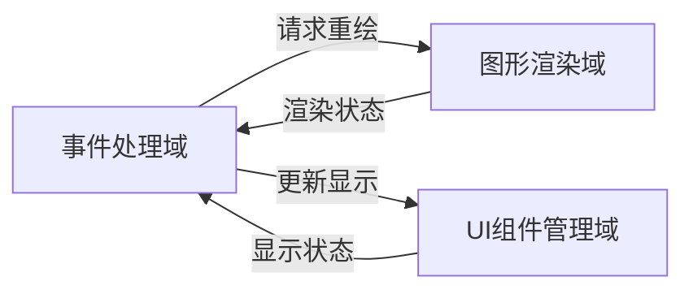

#### 6.2.2 与异常处理域的协作
- **异常捕获**：在事件处理过程中捕获和处理异常
- **错误通知**：将处理过程中的错误通知异常处理域
- **恢复机制**：在异常处理后启动恢复机制

---

## 7. 代码结构深度分析

### 7.1 代码组织架构
```
事件处理域/
├── Executor.php                 # 事件执行核心模块
├── Key.php                     # 键盘处理模块
├── EventSystem/                # 事件系统核心
│   ├── Event.php              # 事件基类
│   ├── EventBus.php           # 事件总线
│   ├── EventDispatcher.php    # 事件分发器
│   └── EventHandler.php       # 事件处理器接口
├── AsyncProcessing/            # 异步处理模块
│   ├── AsyncQueue.php         # 异步队列
│   ├── Worker.php             # 工作线程
│   └── CallbackManager.php    # 回调管理器
└── Keyboard/                   # 键盘处理模块
    ├── KeyMapper.php          # 按键映射
    ├── ShortcutManager.php    # 快捷键管理
    └── InputMethod.php        # 输入法支持
```

### 7.2 核心类设计分析

#### 7.2.1 Executor.php 核心设计
**设计模式**：工厂模式 + 策略模式 + 观察者模式

**关键类结构**：
```php
class Executor implements EventExecutorInterface {
    // 事件注册表
    private EventRegistry $eventRegistry;
    
    // 事件分发器
    private EventDispatcher $dispatcher;
    
    // 处理器链
    private HandlerChain $handlerChain;
    
    // 异步处理队列
    private AsyncQueue $asyncQueue;
    
    // 事件状态管理器
    private EventStateManager $stateManager;
}
```

**核心方法分析**：
- `dispatchEvent()`: 事件分发核心逻辑
- `registerHandler()`: 事件处理器注册
- `processAsyncEvent()`: 异步事件处理
- `handleError()`: 异常处理机制

#### 7.2.2 Key.php 核心设计
**设计模式**：策略模式 + 适配器模式

**关键功能模块**：
- 按键码解析和映射
- 组合键识别算法
- 快捷键冲突检测
- 输入法状态管理

---

## 8. 性能优化策略

### 8.1 事件处理优化

#### 8.1.1 事件批处理
- **批量处理**：将多个同类事件合并处理，减少处理开销
- **去重机制**：过滤重复或无效的事件
- **合并策略**：基于时间和类型的智能合并

#### 8.1.2 内存管理优化
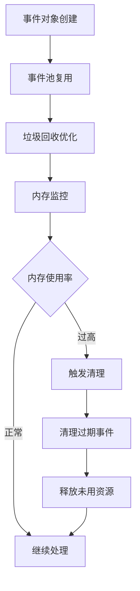

### 8.2 异步处理优化

#### 8.2.1 线程池管理
- **动态调整**：根据系统负载动态调整工作线程数量
- **任务分配**：智能任务分配算法，避免任务集中
- **负载均衡**：多线程间的负载均衡机制

#### 8.2.2 队列优化
- **优先级队列**：高优先级事件的优先处理
- **超时处理**：防止事件队列阻塞
- **容量管理**：动态调整队列容量

---

## 9. 测试与质量保证

### 9.1 测试策略

#### 9.1.1 单元测试覆盖
- **事件分发测试**：验证事件分发的正确性和完整性
- **处理器链测试**：测试处理器链的执行顺序和逻辑
- **异常处理测试**：验证异常情况下的系统行为
- **性能测试**：评估事件处理的性能和响应时间

#### 9.1.2 集成测试场景
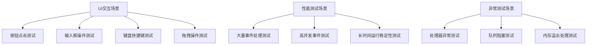

### 9.2 质量指标

#### 9.2.1 性能指标
- **事件响应时间**：< 16ms (60fps要求)
- **吞吐量**：> 1000 events/second
- **延迟抖动**：< 5ms
- **内存使用**：< 50MB (常规负载)

#### 9.2.2 可靠性指标
- **事件丢失率**：< 0.01%
- **处理器成功率**：> 99.9%
- **系统可用性**：> 99.99%

---

## 10. 优势与特色

### 10.1 技术优势

#### 10.1.1 架构设计优势
- **松耦合设计**：通过事件总线实现模块间的低耦合
- **高可扩展性**：支持动态添加新的事件类型和处理器
- **统一管理**：提供统一的事件生命周期管理机制
- **跨平台兼容**：设计考虑跨平台兼容性要求

#### 10.1.2 功能特性优势
- **多模式支持**：同步/异步事件处理的双模式支持
- **智能路由**：基于事件类型的智能路由机制
- **优先级管理**：支持事件优先级和抢占机制
- **错误恢复**：完善的异常处理和错误恢复机制

### 10.2 业务价值

#### 10.2.1 开发效率提升
- **标准化接口**：提供标准的事件处理接口，减少开发复杂度
- **自动路由**：智能事件路由减少手工配置工作
- **调试支持**：完善的事件追踪和调试工具

#### 10.2.2 用户体验改善
- **响应及时性**：优化的事件处理确保用户操作的及时响应
- **交互流畅性**：通过异步处理保证UI的流畅性
- **错误容错**：完善的异常处理机制提高系统稳定性

---

## 11. 潜在改进与发展方向

### 11.1 技术改进方向

#### 11.1.1 性能优化
- **零拷贝优化**：减少事件对象复制，提升处理效率
- **并行处理**：利用多核CPU实现事件的并行处理
- **智能预取**：基于历史模式预加载可能的处理器

#### 11.1.2 功能增强
- **机器学习集成**：利用ML算法优化事件路由和优先级
- **可视化调试**：提供事件流的可视化调试工具
- **实时监控**：实时事件处理性能监控和调优建议

### 11.2 架构演进

#### 11.2.1 微服务化趋势
- **事件服务拆分**：将事件处理拆分为独立的服务
- **分布式事件总线**：支持跨进程的事件通信
- **服务发现机制**：动态发现和管理事件处理服务

#### 11.2.2 云原生适配
- **容器化支持**：事件处理域的容器化部署
- **弹性伸缩**：基于负载的弹性伸缩机制
- **服务网格集成**：与服务网格的深度集成

---

## 12. 总结

事件处理域作为PHP GUI框架的核心交互层，承担着用户交互与UI响应之间的重要桥梁作用。该域通过精心设计的架构和实现，提供了一个高效、可靠、可扩展的事件处理系统。

### 12.1 核心成就
- **完整的生命周期管理**：从事件创建到处理完成的全程管理
- **高效的处理机制**：同步/异步并存的灵活处理模式
- **优雅的错误处理**：完善的异常处理和恢复机制
- **优秀的扩展性**：支持新事件类型和处理器的动态添加

### 12.2 技术价值
事件处理域的设计体现了现代软件架构的精髓：模块化、可扩展、高性能。通过观察者模式、责任链模式等经典设计模式的恰当运用，以及对异步处理、事件驱动等现代架构理念的深入实践，该域为整个PHP GUI框架提供了坚实的交互基础。

该域的成功实现不仅满足了当前的功能需求，更为未来的功能扩展和性能优化预留了充足的空间，是一个值得深入学习和借鉴的优秀架构设计案例。