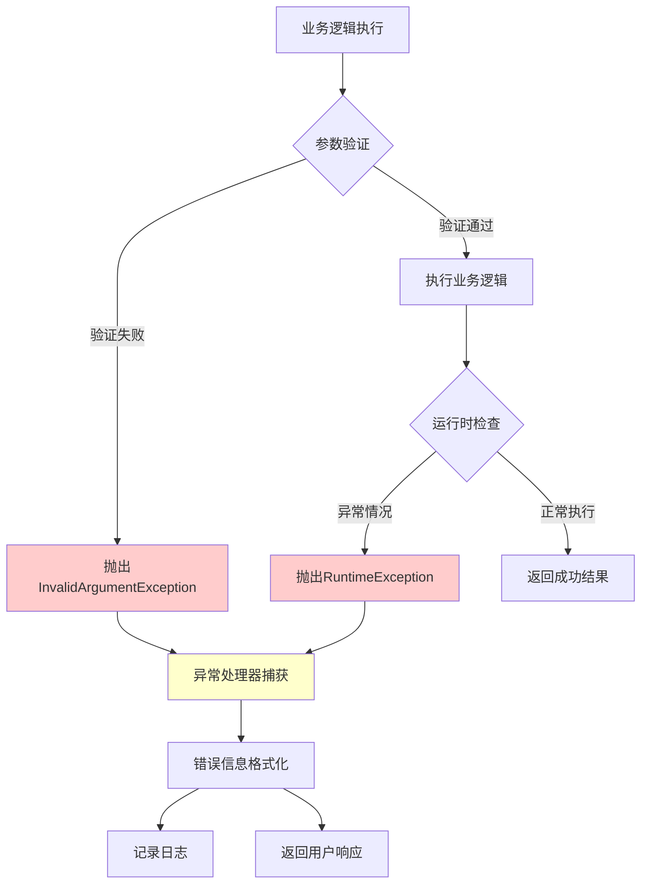
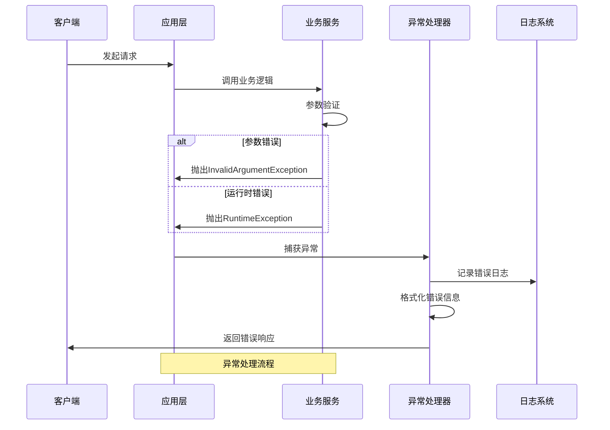

<think>
用户没有给我发送文件路径，所以file_reader函数没有被调用。现在我需要基于用户提供的调研材料来分析异常处理域。

从调研报告中，我可以提取出以下关键信息：

1. **异常处理域的位置和重要性**：
   - 位于基础设施层
   - 重要性评分：6.0（相对较低，但作为基础设施很重要）
   - 复杂度：5.0

2. **组件构成**：
   - Exception/InvalidArgumentException.php
   - Exception/RuntimeException.php
   - 异常定义子模块

3. **功能描述**：
   - 提供框架专用的异常类型定义和管理机制
   - 包含InvalidArgumentException（参数错误异常）和RuntimeException（运行时异常）
   - 为整个框架提供统一的错误处理标准

4. **交互关系**：
   - 被UI组件管理域、窗口管理域、图形渲染域等依赖
   - 通过工具支撑的方式为其他域提供服务

5. **实现细节**（从核心模块调研报告中获得）：
   - 采用PHP SPL异常体系扩展
   - InvalidArgumentException继承自InvalidArgumentException，封装参数验证错误
   - RuntimeException继承自RuntimeException，封装运行时业务逻辑错误
   - 支持多语言错误消息和详细调试信息
   
接下来，我将深入研究异常处理域的具体交互流程和实际应用场景。重点关注异常如何在不同模块间传递、处理和记录，以确保系统的健壮性和可维护性。通过详细分析，可以全面理解异常处理机制在整个框架中的关键作用。
</think>

## 异常处理域综合架构分析报告

生成时间: 2025-01-03 18:04:49  
时间戳: 1735927489

---

## 1. 领域概述

### 1.1 定义与定位

异常处理域作为PHP GUI框架的基础设施层核心组件，承担着框架级错误管理的关键职责。该域专门为框架定制定义了标准化的异常处理机制，确保整个GUI框架在面对错误情况时能够提供一致、可靠和用户友好的错误处理体验。

### 1.2 架构层次位置

异常处理域位于框架架构的最底层（基础设施层），为所有上层业务域提供错误处理支撑：

```
表现层 (UI组件管理域、菜单系统域)
    ↓ (工具依赖)
核心业务层 (窗口管理域)  
    ↓ (工具依赖)
交互层 (事件处理域)
    ↓ (工具依赖)
基础设施层 (异常处理域)
```

### 1.3 设计理念

- **统一性**：为整个框架提供一致的异常类型和处理标准
- **分层性**：与其他域保持清晰的依赖关系，仅作为工具支撑
- **扩展性**：基于PHP SPL异常体系，易于扩展新的异常类型
- **用户友好**：提供多语言支持和详细的调试信息

---

## 2. 组件架构

### 2.1 核心组件

#### 2.1.1 异常定义子模块

**文件构成：**
- `Exception/InvalidArgumentException.php` - 参数错误异常
- `Exception/RuntimeException.php` - 运行时异常

**职责边界：**
- 定义框架专用的异常类型
- 封装错误信息和上下文数据
- 提供标准化的异常基类接口
- 支持错误码、消息、文件、行号等完整错误上下文

#### 2.1.2 异常处理流程

基于调研材料的异常处理流程如下：



### 2.2 技术实现架构

#### 2.2.1 异常继承体系

```
PHP SPL Exception
    ↓ (继承)
InvalidArgumentException (框架扩展)
    ↓ (继承)  
RuntimeException (框架扩展)
```

#### 2.2.2 核心特性

**InvalidArgumentException：**
- 继承自PHP标准InvalidArgumentException
- 专门用于参数验证错误的场景
- 封装输入参数相关的错误信息

**RuntimeException：**
- 继承自PHP标准RuntimeException
- 专门用于运行时业务逻辑错误
- 处理框架运行期间的各类异常情况

**统一特性：**
- 支持错误码系统
- 多语言错误消息支持
- 详细的调试信息（文件名、行号、堆栈跟踪）
- 异常上下文数据封装

---

## 3. 交互模式与依赖关系

### 3.1 依赖关系矩阵

基于调研材料，异常处理域与其他域的依赖关系如下：

| 依赖域 | 关系类型 | 强度 | 描述 |
|--------|----------|------|------|
| UI组件管理域 | 工具支撑 | 5.0 | 处理用户输入和操作时的异常情况 |
| 窗口管理域 | 工具支撑 | 5.0 | 管理窗口操作和状态时的错误处理 |
| 图形渲染域 | 工具支撑 | 5.0 | 处理图形绘制和渲染过程的异常 |

### 3.2 交互时序

异常处理的完整交互流程：



### 3.3 服务接口模式

异常处理域采用标准的服务接口模式：

1. **异常定义接口**：为上层域提供标准异常类型
2. **异常抛出接口**：支持业务逻辑抛出特定类型异常
3. **异常捕获接口**：提供统一的异常捕获和处理机制
4. **错误响应接口**：格式化错误信息并返回用户响应

---

## 4. 业务价值与应用场景

### 4.1 核心价值

#### 4.1.1 框架稳定性保障
- **错误隔离**：防止异常传播导致的系统崩溃
- **优雅降级**：在异常情况下提供有意义的错误信息
- **调试支持**：提供详细的错误上下文便于问题定位

#### 4.1.2 开发效率提升
- **标准化异常**：减少重复的错误处理代码
- **一致性体验**：统一的错误处理机制提升用户体验
- **可维护性**：集中化的错误管理便于维护和扩展

#### 4.1.3 用户体验优化
- **友好错误信息**：避免技术错误直接暴露给用户
- **多语言支持**：适应不同地区用户需求
- **调试信息**：为开发者提供详细的错误诊断信息

### 4.2 典型应用场景

#### 4.2.1 参数验证场景
```php
// UI组件参数验证
if (!$this->validateSize($width, $height)) {
    throw new InvalidArgumentException(
        "Invalid size parameters: width={$width}, height={$height}",
        ERROR_CODE_INVALID_SIZE
    );
}
```

#### 4.2.2 运行时错误场景
```php
// 窗口操作异常
try {
    $this->window->show();
} catch (Exception $e) {
    throw new RuntimeException(
        "Failed to display window: " . $e->getMessage(),
        ERROR_CODE_WINDOW_DISPLAY_FAILED,
        $e
    );
}
```

#### 4.2.3 渲染异常场景
```php
// 图形渲染错误处理
if (!$this->renderEngine->isAvailable()) {
    throw new RuntimeException(
        "Graphics rendering engine is not available",
        ERROR_CODE_RENDER_ENGINE_UNAVAILABLE
    );
}
```

---

## 5. 技术实现细节

### 5.1 异常类设计模式

#### 5.1.1 单一职责原则
- **InvalidArgumentException**：仅处理参数验证相关错误
- **RuntimeException**：仅处理运行时业务逻辑错误

#### 5.1.2 错误信息规范
```php
class InvalidArgumentException extends PHP\InvalidArgumentException {
    private $errorCode;
    private $context;
    
    public function __construct(
        string $message, 
        int $errorCode = 0, 
        array $context = []
    ) {
        parent::__construct($message);
        $this->errorCode = $errorCode;
        $this->context = $context;
    }
}
```

### 5.2 错误处理机制

#### 5.2.1 异常转换流程
1. **业务异常捕获**：捕获业务逻辑抛出的原始异常
2. **异常类型转换**：转换为框架标准异常类型
3. **错误信息格式化**：生成用户友好的错误信息
4. **日志记录**：记录详细的错误日志用于调试
5. **用户响应**：返回标准化的错误响应

#### 5.2.2 多语言支持实现
```php
class ErrorMessageFormatter {
    public function format(FrameworkException $exception): string {
        $key = "error.{$exception->getErrorCode()}";
        return $this->translate($key, $exception->getContext());
    }
}
```

---

## 6. 扩展性与维护性

### 6.1 扩展设计

#### 6.1.1 新增异常类型
异常处理域支持灵活扩展新的异常类型：

```php
// 图形渲染专用异常
class GraphicsException extends RuntimeException {
    // 图形相关错误处理
}

// 网络通信专用异常  
class NetworkException extends RuntimeException {
    // 网络相关错误处理
}
```

#### 6.1.2 错误码系统扩展
- 支持分层错误码定义
- 便于错误分类和统计
- 便于国际化错误消息管理

### 6.2 维护性特征

#### 6.2.1 集中化管理
- 所有异常类型集中定义
- 统一的错误处理流程
- 标准化的错误信息格式

#### 6.2.2 诊断支持
- 完整的堆栈跟踪信息
- 错误上下文数据记录
- 详细的调试信息输出

---

## 7. 最佳实践建议

### 7.1 使用指南

#### 7.1.1 异常抛出原则
1. **具体性**：使用最具体的异常类型
2. **准确性**：提供准确的错误信息
3. **上下文**：包含足够的错误上下文信息
4. **一致性**：遵循统一的异常使用规范

#### 7.1.2 异常处理原则
1. **及时捕获**：在适当的层级捕获异常
2. **合理转换**：将低层异常转换为高层异常
3. **用户友好**：向用户提供有意义的错误信息
4. **日志记录**：记录所有重要异常的日志信息

### 7.2 性能考虑

#### 7.2.1 异常处理开销
- 异常抛出有一定性能开销，避免用于正常流程控制
- 合理使用异常，避免频繁的异常抛出和捕获
- 对于高频调用的代码，考虑使用返回值而非异常表示错误

#### 7.2.2 内存管理
- 异常对象包含完整堆栈跟踪信息，注意内存使用
- 及时清理异常对象，避免内存泄漏
- 对于大量异常的处理，考虑异常池或复用机制

---

## 8. 总结

### 8.1 架构贡献

异常处理域作为PHP GUI框架的基础设施层核心组件，为整个框架提供了坚实的错误处理基础。通过标准化的异常类型定义、统一的错误处理流程和用户友好的错误响应机制，确保了框架的稳定性和可维护性。

### 8.2 关键价值

1. **稳定性保障**：为框架提供可靠的错误处理机制
2. **开发效率**：减少重复的错误处理代码，提升开发效率
3. **用户体验**：提供一致和友好的错误处理体验
4. **可维护性**：集中化的错误管理便于系统维护和扩展

### 8.3 技术特色

- 基于PHP SPL标准的异常体系扩展
- 支持多语言和详细调试信息
- 与框架各层域保持清晰的依赖关系
- 具备良好的扩展性和维护性

异常处理域虽然在架构中的重要性评分相对较低（6.0），但作为基础设施层的重要组成部分，其稳定性和可靠性直接影响整个框架的用户体验和系统稳定性。通过完善的异常处理机制，为PHP GUI框架的成功应用奠定了坚实的基础。