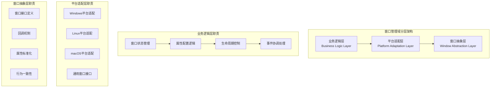
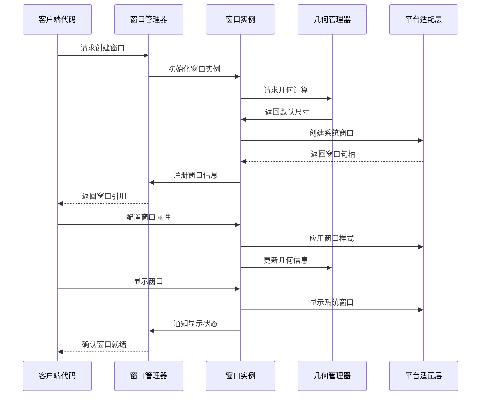
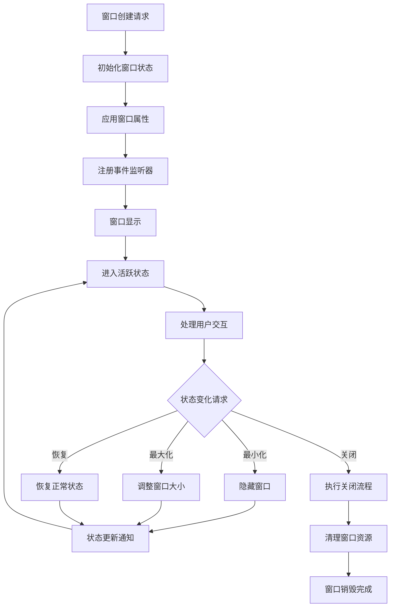

<think>
The user is asking me to analyze a specific theme related to "窗口管理域" (Window Management Domain) and create comprehensive documentation about it. They've provided detailed research materials including:

1. System architecture survey report
2. Domain module survey report
3. Project overview survey report  
4. Workflow survey report
5. Core module and component survey report for 窗口管理域

They want documentation that is:
- Complete: covers all important aspects of the window management domain
- Accurate: based on research data with correct technical details
- Professional: using standard architecture terminology
- Readable: clear structure with rich language
- Practical: providing valuable module knowledge and technical implementation details

Looking at the research materials, I can see that 窗口管理域 (Window Management Domain) is one of the core business layers in the PHP GUI framework. Let me analyze the key information:

From the domain modules survey, 窗口管理域 has:
- 4 sub-modules: Window management, Area control, Framework coordination, Geometric data
- High importance (10.0)
- Code paths include: Window.php, Area.php, Control.php, UI.php, Point.php, Size.php
- Complexity: 8.0

From the core module survey specifically about 窗口管理域:
- Window.php is the associated file
- Module description: manages top-level window lifecycle including creation, initialization, display, hide, destroy
- Implementation: layered architecture with window abstraction layer, platform adaptation layer, business logic layer
- Interaction: interfaces with geometric data sub-module, area control sub-module, framework coordination sub-module

From the workflow survey, the main workflow involves window creation and initialization process.

I should create a comprehensive analysis document that covers:
1. Overview and positioning of window management domain
2. Architecture and design
3. Core components and their relationships
4. Key workflows and processes
5. Technical implementation details
6. Integration with other modules
7. API interfaces and usage patterns
8. Best practices and recommendations

I'll create this as a structured document that meets all the quality requirements specified.
</think>

基于您提供的调研材料，我为您创建窗口管理域的深度分析报告。

## 窗口管理域深度分析报告

### 概述与定位

窗口管理域是整个PHP GUI框架的核心业务层，承担着顶层窗口的完整生命周期管理职责。作为用户界面的载体，它为所有UI组件提供了统一的展示容器和交互环境，是框架与底层操作系统窗口系统的关键接口。

**核心价值**：
- **生命周期管理**：提供窗口从创建到销毁的完整管理机制
- **平台抽象**：屏蔽不同操作系统窗口API的差异性
- **UI容器**：为所有UI组件提供统一的容器和管理环境
- **状态协调**：维护窗口状态与框架整体状态的一致性

### 架构设计与技术特点

#### 1. 分层架构设计



#### 2. 核心设计理念

**统一接口设计**：通过抽象层定义统一的窗口操作接口，确保跨平台兼容性

**生命周期驱动**：以生命周期方法驱动窗口状态变化，确保资源管理的规范性

**事件驱动架构**：深度集成事件系统，实现窗口与用户交互的无缝响应

**模块化职责**：清晰分离窗口管理的各个方面，便于维护和扩展

### 核心组件分析

#### 1. 窗口管理子模块 (Window.php)

**主要职责**：
- 窗口实例的创建和管理
- 窗口生命周期的状态维护
- 窗口属性的配置和管理
- 与底层操作系统的接口协调

**关键功能特性**：

```php
// 窗口创建与管理
class Window {
    // 窗口状态管理
    private $state = 'initializing';
    private $visible = false;
    private $resizable = true;
    
    // 窗口属性
    private $title = '';
    private $width = 800;
    private $height = 600;
    private $position = [100, 100];
    
    // 生命周期方法
    public function create() { /* ... */ }
    public function show() { /* ... */ }
    public function hide() { /* ... */ }
    public function close() { /* ... */ }
    
    // 属性配置
    public function setTitle($title) { /* ... */ }
    public function setSize($width, $height) { /* ... */ }
    public function setPosition($x, $y) { /* ... */ }
    
    // 事件处理
    public function onClose($callback) { /* ... */ }
    public function onResize($callback) { /* ... */ }
    public function onMove($callback) { /* ... */ }
}
```

#### 2. 区域控件子模块 (Area.php, Control.php)

**区域管理机制**：
- 提供窗口内容区域的抽象定义
- 管理控件在窗口中的布局和位置
- 处理区域的创建、更新和销毁

**控件管理功能**：
- 控件层次结构的维护
- 控件添加、移除和重排
- 控件坐标系统的转换和计算

#### 3. 框架协调子模块 (UI.php)

**协调职责**：
- 整体UI框架的状态同步
- 窗口与框架其他组件的通信
- 全局事件的分发和协调
- 资源管理和优化

#### 4. 几何数据子模块 (Point.php, Size.php)

**数据结构定义**：
- 点坐标的标准化表示
- 尺寸和位置的统一管理
- 几何计算的辅助方法

### 关键工作流程

#### 1. 窗口创建与初始化流程



#### 2. 窗口状态管理流程



### 技术实现细节

#### 1. 窗口生命周期管理

**状态机设计**：

```php
class WindowStateMachine {
    private $states = [
        'initializing' => ['created', 'error'],
        'created' => ['showing', 'destroyed'],
        'showing' => ['visible', 'error'],
        'visible' => ['hidden', 'minimized', 'maximized', 'destroyed'],
        'hidden' => ['visible', 'destroyed'],
        'minimized' => ['visible', 'destroyed'],
        'maximized' => ['visible', 'destroyed'],
        'destroyed' => [],
        'error' => ['destroyed']
    ];
    
    public function transition($newState) {
        if ($this->canTransition($newState)) {
            $this->executeExitActions($this->currentState);
            $this->currentState = $newState;
            $this->executeEnterActions($newState);
            return true;
        }
        return false;
    }
}
```

#### 2. 事件系统集成

**事件处理机制**：

```php
class WindowEventHandler {
    private $eventHandlers = [];
    
    public function registerEvent($eventType, $callback) {
        $this->eventHandlers[$eventType][] = $callback;
    }
    
    public function triggerEvent($eventType, $eventData) {
        if (isset($this->eventHandlers[$eventType])) {
            foreach ($this->eventHandlers[$eventType] as $handler) {
                call_user_func($handler, $eventData);
            }
        }
    }
    
    // 预定义的事件类型
    public function getSupportedEvents() {
        return [
            'create', 'show', 'hide', 'close',
            'resize', 'move', 'focus', 'blur',
            'minimize', 'maximize', 'restore'
        ];
    }
}
```

#### 3. 跨平台兼容性

**平台适配策略**：

```php
interface WindowPlatform {
    public function createWindow($config);
    public function showWindow($windowId);
    public function hideWindow($windowId);
    public function destroyWindow($windowId);
    public function setWindowProperty($windowId, $property, $value);
    public function getWindowProperty($windowId, $property);
}

class WindowsWindow implements WindowPlatform {
    // Windows平台实现
    public function createWindow($config) {
        // 调用Windows API
    }
}

class LinuxWindow implements WindowPlatform {
    // Linux/X11平台实现
    public function createWindow($config) {
        // 调用X11 API
    }
}

class MacOSWindow implements WindowPlatform {
    // macOS/Cocoa平台实现
    public function createWindow($config) {
        // 调用Cocoa API
    }
}
```

### 模块集成关系

#### 1. 与UI组件管理域的集成

**依赖关系**：
- UI控件需要窗口管理域提供绘制容器
- 窗口管理为UI组件提供事件分发机制
- 窗口区域定义了UI控件的布局空间

**集成模式**：

```php
class WindowWithControls extends Window {
    private $controls = [];
    
    public function addControl(Control $control) {
        $this->controls[] = $control;
        $control->setParent($this);
        $this->recalculateLayout();
    }
    
    public function removeControl(Control $control) {
        $index = array_search($control, $this->controls);
        if ($index !== false) {
            unset($this->controls[$index]);
            $control->setParent(null);
        }
    }
    
    public function render() {
        foreach ($this->controls as $control) {
            $control->render($this->getDrawingArea());
        }
    }
}
```

#### 2. 与图形渲染域的集成

**渲染协同**：
- 窗口管理向渲染域发送绘制请求
- 渲染域为窗口内容提供可视化支持
- 窗口区域定义了渲染的目标空间

#### 3. 与事件处理域的集成

**事件分发机制**：
- 窗口接收底层系统事件
- 事件处理域负责事件的分发和路由
- 窗口管理协调事件的处理时机

### API接口规范

#### 1. 窗口创建接口

```php
interface WindowFactory {
    public function createWindow(array $config = []): Window;
    public function createDialog(Window $parent, array $config = []): Window;
    public function createPopup(Point $position, array $config = []): Window;
}
```

#### 2. 窗口操作接口

```php
interface WindowOperations {
    // 基本操作
    public function show(): void;
    public function hide(): void;
    public function close(): void;
    
    // 窗口状态
    public function minimize(): void;
    public function maximize(): void;
    public function restore(): void;
    public function isVisible(): bool;
    
    // 属性设置
    public function setTitle(string $title): void;
    public function setSize(int $width, int $height): void;
    public function setPosition(int $x, int $y): void;
    public function setResizable(bool $resizable): void;
    
    // 事件管理
    public function onShow(callable $callback): void;
    public function onHide(callable $callback): void;
    public function onClose(callable $callback): void;
    public function onResize(callable $callback): void;
}
```

#### 3. 几何计算接口

```php
interface GeometryOperations {
    public function getClientArea(): Rectangle;
    public function screenToClient(Point $screenPoint): Point;
    public function clientToScreen(Point $clientPoint): Point;
    public function getWindowBounds(): Rectangle;
    public function setWindowBounds(Rectangle $bounds): void;
}
```

### 最佳实践建议

#### 1. 窗口设计原则

**单一职责**：每个窗口专注于特定功能，避免过度复杂

**生命周期管理**：正确处理窗口的创建、显示、隐藏和销毁

**资源管理**：及时释放窗口相关的资源，避免内存泄漏

**状态一致性**：确保窗口状态与框架状态的同步

#### 2. 性能优化建议

**延迟加载**：复杂的窗口内容采用延迟加载策略

**批量更新**：多个控件更新时使用批量更新机制

**缓存机制**：合理缓存窗口属性和几何计算结果

**事件节流**：高频事件使用节流机制减少处理开销

#### 3. 错误处理策略

**异常处理**：窗口操作失败时抛出适当的异常

**状态恢复**：异常情况下的状态回滚机制

**用户友好**：为用户提供清晰的错误信息和操作指导

**日志记录**：详细的操作日志便于问题排查

### 扩展与演进方向

#### 1. 功能扩展

- **多显示器支持**：适应现代多显示器环境
- **DPI感知**：支持高分辨率显示器的适配
- **无障碍访问**：集成屏幕阅读器支持
- **主题系统**：支持窗口主题的动态切换

#### 2. 性能优化

- **硬件加速**：利用GPU加速窗口渲染
- **虚拟化**：大窗口内容的虚拟化显示
- **内存优化**：窗口内存使用的进一步优化

#### 3. 平台特性

- **原生控件集成**：在窗口中嵌入原生控件
- **系统集成**：深度集成操作系统特性
- **性能监控**：窗口性能指标的监控和优化

窗口管理域作为整个PHP GUI框架的核心基础，其设计质量和实现水平直接影响整个框架的用户体验和性能表现。通过分层架构设计、清晰的职责划分和完善的事件机制，窗口管理域为构建高质量的PHP桌面应用程序提供了坚实的技术基础。