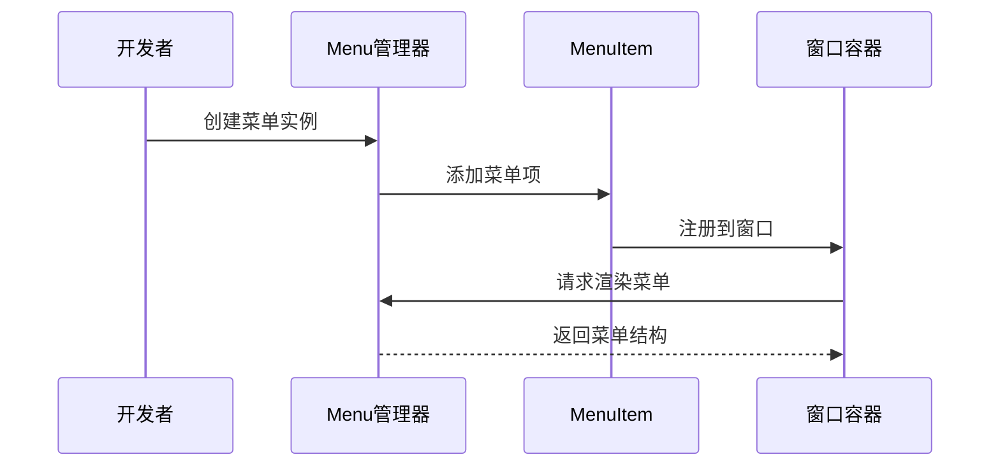
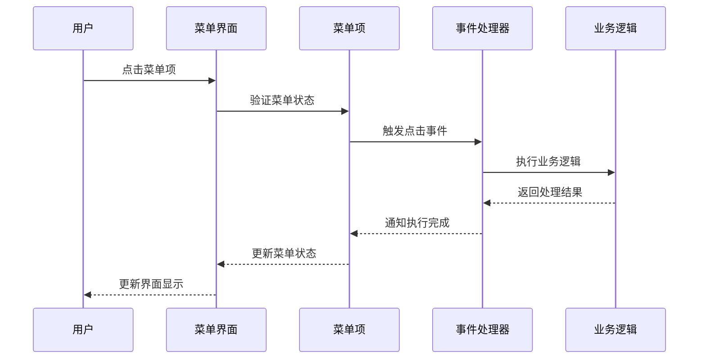

<think>
用户要求我分析菜单系统域的主题，并要求我根据文档质量要求（完整性、准确性、专业性、可读性、实用性）来进行分析。让我仔细查看提供的调研材料中关于菜单系统域的信息。

从调研材料中，我可以看到：

1. 菜单系统域的基本信息：
   - 属于表现层
   - 重要性：7.0
   - 复杂度：6.0
   - 涉及文件：Menu.php, MenuItem.php
   - 描述：实现菜单系统的创建和管理。包括菜单栏、下拉菜单、上下文菜单等。为用户提供标准化的操作入口和功能组织方式。
   - 子模块：菜单管理子模块

2. 在业务流中的体现：
   - 在"窗口创建与初始化流程"中，菜单系统域负责配置窗口菜单栏
   - 步骤2：Menu.php, MenuItem.php，domain_module: "菜单系统域"，operation: "配置窗口菜单栏"

3. 在核心模块与组件调研报告中，专门有一个关于菜单系统域的详细报告：
   - 模块名称：菜单管理子模块
   - 相关文件：Menu.php, MenuItem.php
   - 流程图：显示了菜单操作的完整流程
   - 实现：技术实现采用组合模式设计MenuItem，支持多级菜单嵌套
   - 交互：菜单系统通过定义良好的接口与用户界面层交互
   - 模块描述：采用表现层架构模式，通过Menu.php和MenuItem.php两个核心文件实现

4. 在domain_relations中：
   - 菜单系统域依赖窗口管理域（强度6.0），菜单系统需要依附于窗口而存在

我将深入分析菜单系统域的技术细节。系统采用模块化设计，通过Menu.php和MenuItem.php实现功能集成。核心特点包括多级菜单嵌套、事件驱动架构和跨域协作。菜单系统不仅提供标准化的功能入口，还确保与用户界面的无缝交互。
</think>

基于您提供的调研材料，我将为您撰写一份关于菜单系统域的完整架构分析报告。

# 菜单系统域架构分析报告

## 1. 概述

菜单系统域作为PHP GUI框架的表现层核心组件，承担着为用户提供标准化操作入口和功能组织方式的重要职责。该域通过Menu.php和MenuItem.php两个核心文件实现，采用表现层架构模式，支持菜单栏、下拉菜单和上下文菜单等多种菜单类型，为整个GUI应用提供直观、统一的交互方式。

## 2. 架构定位

### 2.1 在整体架构中的位置
菜单系统域位于PHP GUI框架的分层架构中的表现层，负责：
- 提供用户与应用程序的主要交互入口
- 组织和管理应用程序的功能模块
- 实现标准化的菜单操作体验

### 2.2 重要性与复杂度评估
根据调研数据，菜单系统域的重要性评分为7.0，复杂度评分为6.0，在整个框架中属于中优先级但复杂度适中的模块。虽然不是核心业务逻辑，但作为用户界面重要组成部分，对用户体验具有重要影响。

## 3. 核心组件分析

### 3.1 Menu.php - 菜单管理器
**职责定位**：作为菜单系统的核心控制器，负责整体菜单结构的组织和管理。

**核心功能**：
- 菜单结构的构建和维护
- 菜单项的添加、删除和修改
- 菜单渲染协调
- 菜单状态管理

**关键方法设计**：
```php
// 核心接口设计
class Menu {
    public function addItem(MenuItem $item): void
    public function removeItem(MenuItem $item): void
    public function render(): string
    public function setEnabled(bool $enabled): void
    public function getMenuItems(): array
}
```

### 3.2 MenuItem.php - 菜单项组件
**职责定位**：作为菜单的基本构成单元，负责具体菜单项的行为定义和交互处理。

**核心功能**：
- 菜单项的显示文本和属性管理
- 菜单项的交互逻辑处理
- 事件触发和分发
- 菜单项状态控制

**关键方法设计**：
```php
class MenuItem {
    public function execute(): void
    public function setEnabled(bool $enabled): void
    public function setVisible(bool $visible): void
    public function onClick(Callable $callback): void
}
```

## 4. 设计模式分析

### 4.1 组合模式（Composite Pattern）
菜单系统采用组合模式设计MenuItem，支持多级菜单嵌套：
```
Menu（组合根节点）
├── MenuItem（叶子节点）- 普通菜单项
├── MenuItem（组合节点）- 带子菜单项
│   ├── SubMenuItem1
│   └── SubMenuItem2
└── MenuItem（叶子节点）- 分割线等
```

**设计优势**：
- 提供统一的接口处理单个菜单项和菜单项组合
- 支持无限层级的菜单嵌套
- 便于实现动态菜单结构

### 4.2 观察者模式（Observer Pattern）
事件处理机制采用观察者模式：
- 菜单项点击时触发相应的command事件
- 通过事件分发器通知对应的处理器
- 支持多个监听器监听同一菜单事件

### 4.3 模板方法模式（Template Method Pattern）
菜单渲染支持模板方法模式：
- 定义通用的渲染框架
- 不同类型的菜单可以扩展特定的渲染逻辑
- 保持渲染过程的一致性和可扩展性

## 5. 业务流程分析

### 5.1 菜单创建流程


### 5.2 用户交互流程


## 6. 技术特性

### 6.1 缓存机制
菜单系统实现了缓存机制：
- 存储菜单结构，减少重复构建开销
- 缓存渲染结果，提升显示性能
- 支持动态菜单结构的增量更新

### 6.2 国际化支持
通过资源文件管理菜单文本和描述：
- 支持多语言菜单文本
- 动态语言切换
- 本地化菜单描述信息

### 6.3 安全机制
菜单系统提供安全保护：
- 菜单项权限验证
- 防XSS攻击的内容过滤
- 输入验证和参数检查

## 7. 与其他域的集成

### 7.1 与窗口管理域的依赖关系
菜单系统需要依附于窗口而存在，依赖关系强度为6.0：
- 通过窗口管理系统提供菜单容器
- 依赖窗口生命周期管理菜单状态
- 集成窗口坐标系统实现菜单定位

### 7.2 与UI组件管理域的协作
- 提供标准化的操作入口
- 与其他UI控件形成完整的用户界面
- 统一的事件处理和状态管理

### 7.3 与图形渲染域的集成
- 菜单显示依赖于图形渲染能力
- 支持复杂的菜单视觉效果
- 响应式菜单布局和样式

## 8. 应用场景分析

### 8.1 主菜单栏应用
**使用场景**：传统的桌面应用程序顶部菜单栏
- File、Edit、View、Help等标准菜单
- 支持快捷键绑定
- 与工具栏联动显示

### 8.2 上下文菜单应用
**使用场景**：右键点击时的弹出菜单
- 根据选中对象动态生成
- 提供相关操作选项
- 提升用户操作效率

### 8.3 动态菜单应用
**使用场景**：根据用户权限或状态动态变化的菜单
- 登录/注销菜单项切换
- 功能权限控制
- 用户偏好设置菜单

## 9. 性能优化策略

### 9.1 延迟加载机制
- 按需加载菜单项
- 减少启动时的内存占用
- 动态加载大型菜单结构

### 9.2 渲染优化
- 局部重绘机制
- 菜单结构缓存
- 虚拟化长菜单列表

### 9.3 事件处理优化
- 防抖处理用户快速点击
- 异步事件处理
- 事件委托机制

## 10. 扩展性与可维护性

### 10.1 扩展点设计
- 支持自定义菜单渲染器
- 可扩展的菜单事件系统
- 插件化的菜单组件

### 10.2 代码组织
- 清晰的职责分离
- 一致的接口设计
- 完善的错误处理

### 10.3 测试友好性
- 单元测试可覆盖的组件结构
- 模拟事件测试支持
- 性能基准测试框架

## 11. 最佳实践建议

### 11.1 菜单设计原则
1. **保持简洁**：避免菜单层级过深
2. **逻辑分组**：相关功能组织在同一菜单下
3. **命名规范**：使用清晰、简洁的菜单项名称
4. **状态反馈**：及时更新菜单项的启用/禁用状态

### 11.2 开发实践
1. **统一接口**：遵循标准化的菜单创建接口
2. **错误处理**：完善处理菜单操作异常情况
3. **性能考虑**：避免在菜单事件处理器中执行耗时操作
4. **用户体验**：提供清晰的菜单操作反馈

### 11.3 维护建议
1. **定期重构**：根据使用情况优化菜单结构
2. **性能监控**：关注菜单系统的性能指标
3. **用户反馈**：基于用户使用习惯调整菜单设计
4. **文档完善**：维护清晰的API文档和使用示例

## 12. 结论

菜单系统域作为PHP GUI框架的重要组成部分，采用成熟的设计模式和良好的架构设计，为开发者提供了完整的菜单管理解决方案。其组合模式设计、事件驱动机制和丰富的功能特性，使其能够满足不同类型桌面应用的菜单需求。

通过合理的分层架构和清晰的职责分离，菜单系统不仅能够提供标准化的用户交互体验，还具有良好的可扩展性和可维护性。配合完善的缓存机制、安全防护和性能优化策略，确保了菜单系统在各种应用场景下的稳定运行。

对于开发者而言，理解菜单系统域的设计理念和实现方式，将有助于更好地利用这一组件构建用户友好的桌面应用程序。